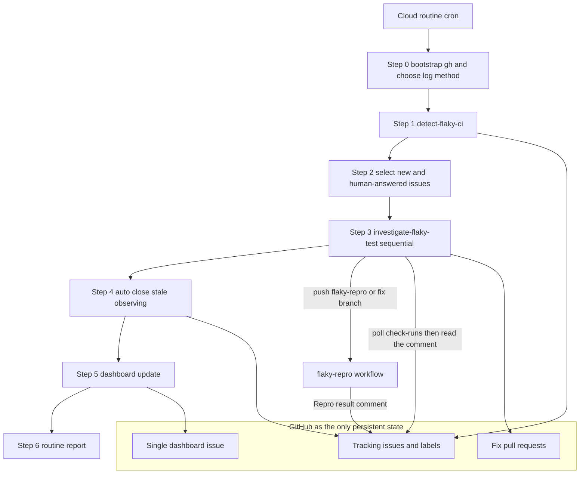
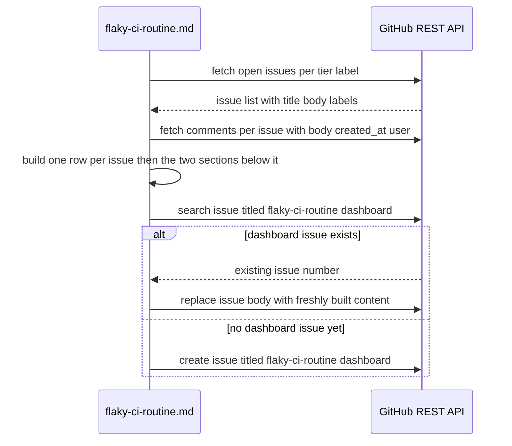
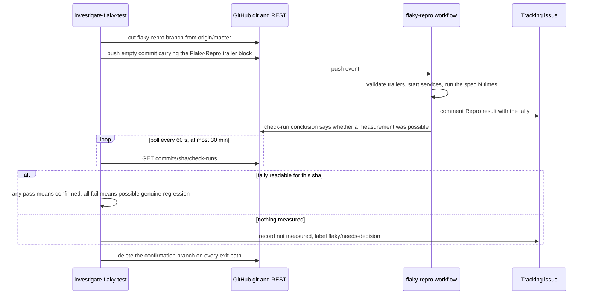
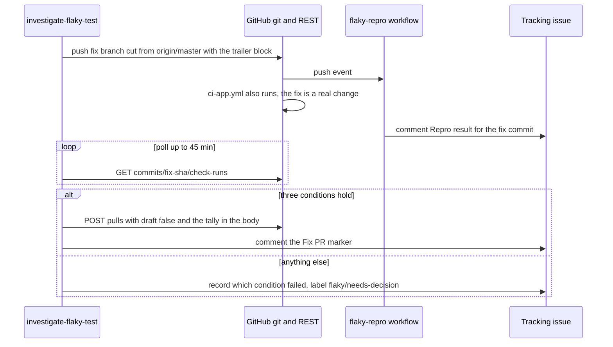
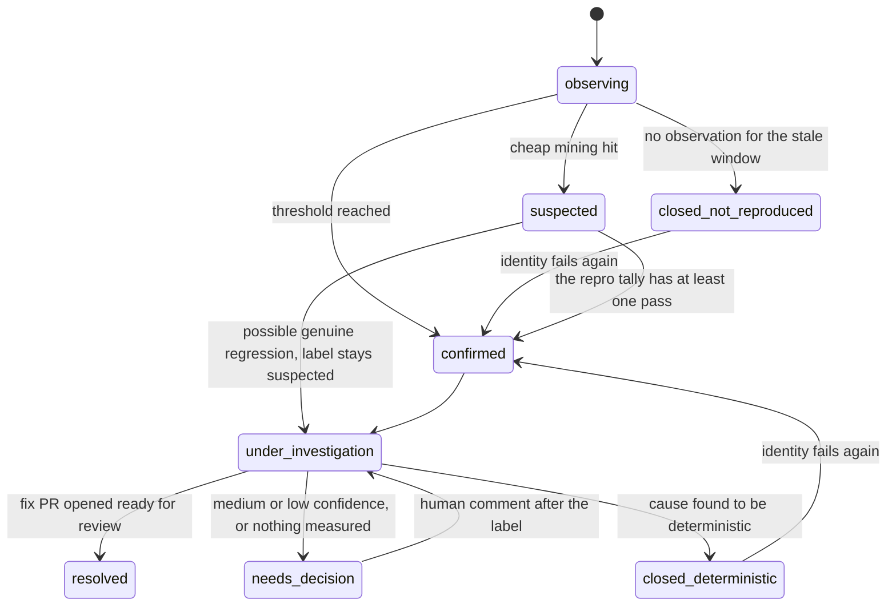

# Design Document

## このドキュメントに何を書くか（Write / Don't-Write test）

このspecは「実装の記録」ではなく「次にこの機能へ手を入れる人の出発点」である。
各セクションを書く・残すときは、次の問いを当てる:
**その内容は、コードとテストファイルを読めば再現できるか？** 再現できるなら
書かない。

| 書く | 書かない |
|---|---|
| 実際に調査・検証して分かった事実（コードをさっと読んだだけでは分からない挙動、外部ライブラリの隠れた挙動） | 関数シグネチャ、ファイル構成図、「どのファイルに何があるか」 |
| なぜその設計にしたか（特に、検討した末に**却下した案とその理由**） | 素直な実装のありのままの説明 |
| 自動テストで**担保できていない**残課題 | どのテストが何をカバーしているかの一覧（試験ファイルを読めば分かる・すぐ陳腐化する） |
| コードから再現できない手動検証手順（再現環境の作り方、何を見るか、合否のしきい値） | 差分の有無・実装時期などの時点情報 |

迷ったら書かない。コードから読み取れる内容をspecに書くと、コードが変わった
瞬間に気づかれずに陳腐化し、それがドキュメント全体の信頼を落とす。

（この原則は`requirements.md`のAcceptance Criteriaには適用しない。ACは
「実装の説明」ではなく「実装が満たすべき契約」であり、番号は`tasks.md`の
`_Requirements:_`やコード・テストのコメントから参照される生きた識別子
なので、要約への統合や採番変更の対象にはしない）

## Overview

この design.md は、手順そのものを持たない。手順は 3 つの Markdown ファイル
（`detect-flaky-ci/SKILL.md`、`investigate-flaky-test/SKILL.md`、
`flaky-ci-routine.md`）と 1 本の workflow が正であり、ここに書くのは
**ファイルをまたいで一致していなければならない約束事**と、**なぜその形なのか**
だけにする。「どうやるか」を知りたいときは、各節が名指しするファイルを読む。

**Purpose**: `flaky-ci-routine` は GROWI の CI（`ci-app.yml` /
`ci-app-prod.yml`）で発生する非決定的なテスト失敗（flaky test）を無人で
検出・追跡・調査・修正し、常設ダッシュボードでチーム全体に可視化する。人が
介在しなくても、検出された flaky test が確認 → 修正 PR → クローズへ進むか、
あるいは「人の判断待ち」として見える場所に残るかのどちらかに必ず落ち着く。

**Users**: GROWI のコミッター・メンテナーが利用者。直接操作するのではなく、
生成される GitHub issue・PR・ダッシュボード issue を通じて成果物を受け取り、
判断待ちの issue にコメントで答えることでループに関与する。

**Impact**: 仕組みは 4 つの部品でできている。検出スキル
`.claude/skills/detect-flaky-ci/`、調査スキル
`.claude/skills/investigate-flaky-test/`、両者を順に呼ぶオーケストレーション
コマンド `.claude/commands/flaky-ci-routine.md`、そして測定器である GitHub
Actions ワークフロー `.github/workflows/flaky-repro.yml`。アプリケーション
コードには一切触れない。永続状態は GitHub の issue / label / comment / PR
だけで、ルーティンは実行間の記憶を持たない。

### Goals
- 疑いあり issue の確認と修正の検証を、`actions:write` 権限の無い実行環境でも
  数値の集計として取得する（Requirement 6）
- 1 つの原因から出た失敗を 1 件の追跡 issue にまとめ、flaky でない失敗を
  追跡対象から外す（Requirement 7・8）
- 判断待ちを状態として持ち、人の返答で自動的に再開する（Requirement 9）
- 再発しない issue を自動で閉じる（Requirement 10）
- 起動間隔と隣接ルーティンを整合させる（Requirement 11）
- 追加する状態はすべて GitHub の issue / label / comment に載せ、新しい永続
  ストアや外部サービスを持ち込まない

### Non-Goals
- 新しい外部サービス・SaaS の導入（`research.md` で対象外と明記済み）
- 日次/週次のアーティファクト定期出力（`brief.md` で不採用と理由を明記済み）
- 検出ロジックの完全なスクリプト化（`research.md` に将来案として記録のみ）
- テスト基盤そのものの修正と、個別テストの設計不良の修正。これらは通常の PR
  で扱う
- Playwright（e2e）の再現実行。Playwright は同一 run 内の retry が既に
  非決定性の証拠なので、再現ワークフローの対象にしない
- routine が使うモデルの選択（`research.md` に判断材料のみ記録）

## Boundary Commitments

### This Spec Owns
- `ci-app.yml` / `ci-app-prod.yml` 上の vitest / playwright テストに対する、
  非決定的失敗の検出・識別子の集約・追跡対象外の判定・確信度別ラベリング・
  GitHub issue 追跡
- confirmed / suspected issue の自律調査・原因分類・修正の検証・修正 PR 作成
- 再現実行の依頼と結果の**約束事**（git trailer の名前と値の範囲、結果
  コメントの見出しと行の形、ブランチ名パターン）と、それを実行する
  `.github/workflows/flaky-repro.yml` の挙動
- ラベル `flaky/needs-decision` の意味と、付ける・外す条件
- 単一の常設ダッシュボード issue の create-or-update と、その節の構成
- 再発しない観測中 issue の自動クローズ
- クラウド routine 2 つ（`growi-flaky-ci-routine`、`Investigate GROWI
  Issues`）のプロンプト文言

### Out of Boundary
- CI インフラ自体の信頼性（ネットワーク・OOM 等）向上
- `ci-app.yml` / `ci-app-prod.yml` のジョブ構造。`ci-app.yml` へは
  `branches-ignore` を 1 行足すだけで、サービス起動手順の共通化は行わない
- `ci-app.yml` / `ci-app-prod.yml` 以外のワークフローで発生する失敗。
  `flaky-repro.yml` は監視対象ではなく、この仕組み自身の測定器である
- `apps/app` 配下のテスト・テスト基盤・アプリケーションコード
- 生成された PR のレビュー・マージ判断（通常の開発ワークフローに委譲。
  routine は自分でマージしない）
- 商用 SaaS の導入・比較検討

### Allowed Dependencies
- GitHub REST API（`gh api` 経由）— issue / label / comment / PR / Actions
  run / check-runs / commits compare / issue events の読み書き全般。GraphQL は
  使わない（クラウド実行環境の egress proxy が遮断する）
- ジョブログの取得 — `gh api --allow-escape-sequences
  repos/growilabs/growi/actions/jobs/{JOB_ID}/logs`、または GitHub MCP
  サーバーの `mcp__github__get_job_logs`。どちらを使うかは実行開始時に 1 回
  だけ決める（Requirement 4.2）
- GitHub Actions（push トリガー、`GITHUB_TOKEN` の `contents: read` /
  `issues: write`）
- `apps/app` の vitest プロジェクト名と `package.json` のテストスクリプト名
  （`test:unit` / `test:components` / `test:integ`）— 読むだけ
- RemoteTrigger cron — 定期起動の契機

### Revalidation Triggers
- `ci-app.yml` / `ci-app-prod.yml` のファイル名変更、またはジョブ名の構造変更
  （identity key 抽出ロジックと、Fix Verification が見る `ci-app-` 接頭辞が
  依存している）
- `flaky/observing` / `flaky/suspected` / `flaky/confirmed` /
  `flaky/needs-decision` / `flaky/dashboard` / `phase/*` ラベル名の変更
- cron 頻度の変更（スキャン窓 = 最長の起動間隔 × 2 という前提を計算し直す）
- `gh` CLI のメジャーバージョン更新による REST 応答フィールドの変化
- **`flaky-ci-routine.md` の Shared constants ブロックのどれかが変わったとき**
  — `flaky/needs-decision`、`- Recommendation:` 行、停止の 2 手（ラベル →
  コメント）の順序と現在の停止の時間幅、自動投稿の署名文言。このブロックが
  唯一の定義場所で、両スキルとダッシュボードがそれぞれ一部を実装している
  ので、変えるときは読み手をすべて直す
- コメント見出しの文言の変更 — `### Additional observation` /
  `### Backfilled observation`（ダッシュボードの Occurrences 算出がこれに
  一致することへ依存）、`### Repro result`、`### Collateral candidate`、
  `### Auto-closed: not reproduced within `、
  `### Closed: deterministic cause, not flaky`、`**Fix PR**: ` マーカー
- trailer 名（`Flaky-Repro-*`）、結果コメントの固定 7 行の形と並び、
  ブランチ名パターン（`flaky-repro/**`、`fix/flaky-**`）の変更
- **`ci-app.yml` の `ci-app-test-integration` のセットアップ範囲の変更** —
  `flaky-repro.yml` はこの範囲（`pnpm/action-setup`、`setup-node` の Node
  バージョンと pnpm キャッシュ、dist キャッシュのキー形式、依存インストール
  のコマンド、MongoDB / Elasticsearch の起動と待ち合わせ）を複製している。
  アクション・バージョン・dist キャッシュのキー形式のいずれかが変わったら
  同じコミットで両方直す。両ファイルに相互参照コメントを置いてある
- `apps/app/turbo.json` の `test:*` タスクの `dependsOn` の変更 —
  `flaky-repro.yml` は turbo を経由せずテストを直接呼ぶため、前提生成物の
  ビルドを自前で並べている（`turbo run test:unit --filter=@growi/app
  --dry-run` で確認できる）
- vitest プロジェクト名の追加・改名、`test:*` スクリプトの変更（再現
  ワークフローの allowlist が持っている）

## Architecture

### Existing Architecture Analysis

- 状態は GitHub の issue / label / comment / PR にだけ持ち、ルーティンは実行
  間の記憶を持たない。再現実行の結果も issue コメントとして残す
- `detect-flaky-ci` はコードに触れず、修正は `investigate-flaky-test` が行う
  という分離を保つ。再現ワークフローは両者から独立した「測定器」で、どちらの
  スキルも同じ約束事で使う
- `flaky-ci-routine.md` は薄いオーケストレーションに留める。検出・調査の
  ロジックは持たず、Step 0 で `gh` の疎通とジョブログ取得手段を 1 回だけ決め、
  以降は順番と選択条件だけを持つ
- 通信は REST のみ。`gh issue` / `gh label` / `gh pr` は GraphQL 経由なので、
  クラウド実行環境では同等の `gh api` 呼び出しに置き換える

### Architecture Pattern & Boundary Map



**Architecture Integration**:
- Selected pattern: 「2 つのスキル＋薄いオーケストレーションコマンド」に、
  GitHub Actions 上の測定器を 1 本足した形。測定器はスキルから見ると「push
  すると issue にコメントが返ってくる」だけの部品で、スキル側に新しい権限を
  要求しない
- Domain/feature boundaries: 検出（識別・集約・除外）／調査（確認・修正・PR）
  ／可視化と選択（判断待ち・自動クローズ・ダッシュボード）／測定
  （workflow）の 4 つ
- Existing patterns preserved: 状態を持たない設計、exact-title-match による
  重複防止、`-X GET` 必須の `gh api` 呼び出し規約、コメント見出しによる
  機械的な分類
- New components rationale: 測定器を GitHub Actions 側に出したことで、CI の
  再実行権限を持たない実行環境でも「数字で確認する」が成立する。判断待ち
  ラベルは「止まっている」を状態にするために要る
- Steering compliance: 該当なし（この spec は apps/app のコード規約の対象外。
  `tech.md` の内容は Node/Turbopack/Prisma 等アプリ本体のスタックであり、本
  spec は Claude Code スキル/コマンドの Markdown と GitHub Actions の YAML、
  `gh` 呼び出しだけで構成される）

## File Structure Plan

この spec はアプリケーションコードを持たず、Claude Code のスキル/コマンド
定義（Markdown）と GitHub Actions ワークフロー（YAML）で構成される。

### 各ファイルの責務

- `.github/workflows/flaky-repro.yml` — 測定器。head commit の trailer を
  読み、allowlist で検証し、対象 spec を指定回数実行して集計を追跡 issue の
  コメントとジョブサマリに書く。**テストの合否では job を落とさない**
  （落とすのは前処理の失敗だけ）
- `.github/workflows/ci-app.yml` — `on.push.branches-ignore` に
  `flaky-repro/**` を持つ。さらに `ci-app-test-integration` のセットアップ
  範囲の先頭に、`flaky-repro.yml` がその範囲を複製している旨の相互参照
  コメントを置く
- `.github/workflows/ci-app-prod.yml` — `on.push.branches` が allowlist 方式
  なので `flaky-repro/**` は元から一致しない（GitHub は `branches` と
  `branches-ignore` の併用を許さない）。ここには除外が成立している理由の
  コメントだけを置く
- `.claude/skills/detect-flaky-ci/SKILL.md` — スキャン、インフラノイズの
  除外、識別子の抽出と集約（巻き添え・連鎖・共有フック）、追跡対象外の判定、
  既存 issue との照合と作成・更新・格上げ・再オープン
- `.claude/skills/investigate-flaky-test/SKILL.md` — 確認ゲート、原因の分類、
  決定的原因のクローズ、修正、修正の検証と PR 作成、停止の作法
- `.claude/commands/flaky-ci-routine.md` — Shared constants（複数ファイルが
  一字一句合わせる文字列と、停止の 2 手の順序）の唯一の定義場所。Step 0 の
  起動確認から Step 6 の報告までの順番、対象の選択条件、自動クローズ、
  ダッシュボードの本文生成

### Prerequisite（ファイルの変更ではない）
- GitHub ラベルを事前に作る: `flaky/dashboard`（ダッシュボード issue を他の
  検索から区別する）、`flaky/needs-decision`（判断待ち）。説明文は 100 文字
  以内
- クラウド routine のプロンプト設定（Operations Config を参照）

## System Flows

### ダッシュボードの更新



**Key Decisions**:
- ダッシュボード更新は investigate ループと自動クローズが終わった**後**に
  行う（Requirement 5.4・10.3: この実行で解決・クローズされた issue を
  即座に一覧から外すため）。ここでの「解決された」は issue が**クローズ
  された**ことを指す。`investigate-flaky-test` が付ける `phase/resolved`
  は「調査は完了した」の意味で、issue 自体は open のままのことが多い
  （修正 PR がレビュー待ちの間など）。そのため「アクティブ」の判定は
  `phase/*` を見ず、issue の open/closed だけで行う
- issue 本文は毎回**全置換**する（追記しない）。これにより、途中で issue が
  解決・再オープンされても次回更新時に必ず正しい状態に収束する
  （Requirement 5.5 の「アクティブな flaky が 0 件でも更新する」も自然に
  満たす）
- 「ルーティンの実行が完了した場合」（Requirement 5.1）は、個々の調査の完了
  ではなく、このルーティン 1 サイクルの完了を指す。調査が判断待ちで止まった
  場合も**必ず**ダッシュボードを更新し、止まっている issue はその時点の tier
  のまま表に含める

### 疑いあり issue の確認（Requirement 6.1〜6.3, 6.6）



- 確認用ブランチは **`origin/master` から切る**。測る問いは「いま master で
  その spec が非決定的か」であり、失敗コミットの木には `flaky-repro.yml` が
  存在しないので、そこから切っても workflow がそもそも起動しない。spec が
  master に無ければ workflow が依頼を拒否し、「確認未実施」の経路に入る
  （これは正しい結果で、不具合ではない）
- 空コミットなので通常 CI は増えない。`ci-app.yml` は `flaky-repro/**` を
  `branches-ignore` に持ち、`ci-app-prod.yml` は allowlist 方式で一致しない
  （Requirement 6.7）
- 待ち時間は 60 秒間隔・上限 30 分。ただし **5 分たっても `flaky-repro` の
  check-run が現れなければ、そこで待つのをやめる** — 測定器が起動しなかった
  という答えは既に出ており、残り 25 分待っても変わらない
- 確認ゲートを通るのは `flaky/suspected` の issue だけ。`flaky/confirmed` は
  既に実証済み（Playwright の in-run retry、または閾値に達した独立観測）
  なので、確認の測定を 1 回も使わずに原因追及へ進む
- `src/features/growi-vault/__tests__/` 配下の spec は
  `app-integration-vault` プロジェクトに属し、測定器の allowlist に無い。
  依頼を push せず「確認未実施（vault 用の再現プロジェクトが無い）」として
  判断待ちにする

### 修正の検証と PR の作成（Requirement 3.5, 6.4, 6.5）



- PR を作る条件は**次の 3 つすべて**で、判定する場所は 1 か所だけにする。
  (1) 修正コミットの SHA に紐づく `### Repro result` コメントが存在し、
  `- Failed: 0` かつ `- Runs:` が依頼した回数以上、(2) `ci-app-` で始まる
  check-run が 1 件以上あり、その**すべて**が `success`（0 件は「何も動か
  なかった」であって「何も落ちなかった」ではない）、(3) 差分が原因追及で
  特定した範囲に収まっている
- 条件 (3) の差分は `git diff --name-only origin/master...{FIX_SHA}` の
  **3 点表記**で取る。2 点表記だと、ブランチが master より遅れているだけで
  master 側にしか無いファイルまで差分に混ざり、条件が成立しなくなる
- 修正ブランチも `origin/master` から切る。`flaky-repro.yml` が木に無い
  コミットを基点にすると check-run が 1 件も作られず、ゲートに判定材料が
  無くなる
- PR は最初から `draft: false` で作る。下書きを Ready にする操作は GraphQL
  専用（`markPullRequestReadyForReview`）で REST に同等物が無く、クラウド
  実行環境では呼べない。「レビュー可能にしてよいか」は PR を作る前のゲート
  で決まるので、作った後に状態を変える手順そのものが不要になる
- 上限 45 分。ただし 5 分以内に `flaky-repro` または `ci-app-*` の check-run
  が 1 件も現れなければそこで打ち切る（トリガーが一致しなかった、という答え
  が既に出ている）
- **Playwright の修正は測定を依頼しない**。測定器の allowlist は vitest の
  プロジェクトだけなので、再生するものが無い。条件 (1) を外して (2)(3) だけ
  で PR を開き、本文に「検証はマージキュー上の `run-playwright` に委ねる」
  と書く。`reusable-app-prod.yml` はこのジョブを `head_ref` が
  `mergify/merge-queue/` で始まるとき（または `workflow_dispatch`）にだけ
  実行するので、**修正ブランチへの push でも、PR を開いた時点でも動かない**
  — 動くのはマージキューに入ったときで、そこで Playwright 自身の
  `retries: 2` が重なる

### 判断待ちで止まり、人の返答で再開する（Requirement 9）

- 停止するときの 2 つの書き込みは **ラベル → コメント** の順に行う。
  ダッシュボードは「`flaky/needs-decision` が最後に付いた時刻（= 停止時刻）
  以降のコメント」から推奨行を読むので、コメントを先に書くと、正しく止めた
  issue ほど「情報が古いかもしれない」印が付くという逆の結果になる。時計の
  ずれを吸収するため、ダッシュボード側は **停止時刻の 120 秒前から先** を
  受け入れる
- 停止コメントは、**最後から 2 行目が自動投稿の署名、最終行が
  `- Recommendation: <1 行>`** という並びで終わる。ダッシュボードは最終行を
  そのまま推奨欄に写す。停止コメント以外のコメントは署名が最終行で、
  `**Fix PR**: ` マーカーだけは署名を付けない（ダッシュボードが完全一致で
  照合する 1 行なので、何も足さない）
- 再開の条件は**人の新しいコメントだけ**。新しい観測が増えたことや、時間が
  経ったことでは再開しない。止まった理由が「人の判断が無い」ことなので、
  判断が来ないまま再開しても同じ場所で止まり、CI 時間だけ使う
- 「人のコメント」の判定は 2 つの検査を**両方**行う。(1) 投稿者が bot
  （`user.type == "Bot"`）でないこと、(2) 本文に自動投稿の署名文字列を
  含まないこと。ルーティンが人のメンテナーの `gh` トークンで動くとき、
  自分が投稿したコメントも `user.type == "User"` になるため、投稿者の検査
  だけでは自分の言葉を人の判断として読んでしまう
- 再開したとき、`investigate-flaky-test` は**最初に**
  `flaky/needs-decision` を外す。ルーティン側は外さない — 再開が途中で
  死んだ issue が「止まったまま」に見え続けるようにするため
- 人の判断でゲートを通したときは、**どの選択肢が選ばれ、どのコメントから
  来たか**を 1 段落で記録する。記録先は、再開した経路が**最初に投稿する
  コメント**。調査を続ける場合はその宣言のコメント、閉じる判断なら閉じる
  コメントそのもの（決定的原因なら `### Closed: deterministic cause, not
  flaky`、再現しないことを理由に閉じるなら後述のクローズコメント）。閉じる
  判断では「続ける」コメントが投稿されないので、そこだけに書く決まりに
  すると、issue が終わる 2 つの答えで記録が丸ごと落ちる。PR を開くときは
  PR 本文の Root Cause 節にも同じ段落を置く。人の言葉で通したゲートが、
  後から「証拠だけで通った」と読めてはいけない
- 人の判断が「再現しないので閉じる」だったときのクローズコメントは、
  routine の自動クローズと**見出しの接頭辞 `### Auto-closed: not
  reproduced within ` だけを共有する**。これは意図的で、再オープンの
  ガード（人が手で再オープンした issue を次の実行が閉じ直さない判定）と
  観測数から外す判定が、どちらもこの接頭辞で照合しているため。識別が
  戻ってきたとき、人が決めたクローズが自動クローズとまったく同じ振る舞い
  をする。中身は違う: しきい値は適用していないので `--stale-days` は現れず、
  「誰が閉じたか」と人の判断コメントの URL が入る。最終観測日が求まらない
  ときは投稿もクローズもせず、判断待ちに戻す
- 停止した issue や作った PR を、イベントの購読・通知の予約・再起床の予約で
  監視し続けない（Requirement 9.5）。回復の手段は「次回の定期実行」だけ。
  確認・検証で行う check-run の待ち合わせ（60 秒間隔、上限 30 分 / 45 分）は
  購読ではない — 始めたステップを止めて待ち、自分で終わり、後に何も残さない

### 再発しない issue の自動クローズ（Requirement 10）

- 対象は open かつ `flaky/observing` のみ。`suspected` / `confirmed` は既に
  証拠が複数あるか調査対象なので閉じない
- 最終観測日 = 本文の `### First observation` と観測コメント
  （`### Additional observation` / `### Backfilled observation`）が持つ
  `Date:` の最大値。既定 14 日（`--stale-days=N` で上書き可）以上経過した
  ものを `not planned` でクローズする
- クローズのコメントに **`Fixed by` を書かない**。この「書かない」ことが
  再オープン経路の前提になっている: `detect-flaky-ci` は、閉じた issue の
  識別が再び失敗したとき、解決時刻を `Fixed by #{PR}` の記載から求め、
  記載が無ければ「解決時刻が分からない」として再オープン側に倒す。ここで
  解決の印を書くと、存在しない修正と比較して新しい証拠を「修正前のノイズ」
  として黙って捨ててしまう（Requirement 10.2）
- ラベルは触らない。`flaky/observing` を残したまま閉じるので、再オープン時
  に `flaky/confirmed` が加わって 2 つの tier ラベルが並ぶことがある。
  ダッシュボードは issue 番号で重複を排し、強いほうの tier を採るので 1 行
  にまとまる
- 人が手で再オープンした issue を、次の実行が再びクローズしない。この Step
  が最後にクローズした時刻より後に `reopened` イベントがあれば対象外にする

### 決定的な原因と分かったときのクローズ（Requirement 8.4）

- 依存関係の重複、生成物の不足、ビルド順序、マージキュー上だけの不整合など、
  条件が揃えば**毎回**失敗するものは flaky ではない。`### Closed:
  deterministic cause, not flaky` を見出しに持つコメントを書き、
  `not planned` でクローズし、phase ラベルを `⏏ phase/wontfix` に付け替える
  （`5️⃣ phase/resolved` は使わない — この調査は何も解決していない）。tier
  ラベルはそのまま残す
- ここでも `Fixed by` は書かない。原因の修正を扱う別の issue / PR があれば
  リンクしてよく、そうすると再発したときに「その PR のマージ時刻」を境界に
  して、前の失敗は修正前の証拠、後の失敗は本物の回帰、と正しく切り分けられる
- クローズ後に Step 4〜6 は走らない。修正ブランチも PR も作らない
- 再発したときは既存の再オープン経路で戻ってくる。そのとき issue は
  「確定済みの新しい flake」の見た目で届くので、**再オープンされた issue を
  拾ったら、まずコメントに `### Closed: deterministic cause, not flaky` が
  無いかを読む**。あればそれは「決定的な原因がまた出ている」であって、
  確認の測定を使い直して同じ原因を再発見する必要はない

## Components and Interfaces

| Component | Domain/Layer | Intent | Req Coverage | Key Dependencies (P0/P1) | Contracts |
|---|---|---|---|---|---|
| Detection Scan | detect-flaky-ci | CI run をスキャンし非決定的失敗を検出、インフラノイズを除外 | 1.1–1.6 | GitHub Actions API (P0) | Batch |
| Identity Aggregation | detect-flaky-ci | 共有フック・巻き添え・連鎖を 1 identity にまとめる | 7.1–7.3 | ジョブログ (P0) | State |
| Non-flaky Exclusion | detect-flaky-ci | master に無いコミットで PR 自身が触った spec の失敗を追跡対象外にする | 8.1–8.3 | REST compare / pulls files (P0) | — |
| Escalation Tiering | detect-flaky-ci + investigate-flaky-test | 3 層の確信度に応じたラベル遷移と再オープン | 2.1–2.7 | GitHub Issues/Labels API (P0) | Batch, State |
| Repro Request / Result | 測定（共有契約） | 依頼（git trailer）と結果（issue コメント）の形を固定する | 6.1–6.4 | — | Event, State |
| Repro Workflow | 測定（GitHub Actions） | 依頼を受けて対象 spec を N 回実行し、集計を書く | 6.1, 6.4 | GitHub Actions (P0), Repro Request / Result (P0), `ci-app.yml` と同じセットアップ (P1) | Batch, Event |
| CI Exclusion | 測定 | 確認用ブランチで通常 CI を動かさない | 6.7 | `ci-app.yml`, `ci-app-prod.yml` (P0) | — |
| Confirmation Gate | investigate-flaky-test Step 2 | 疑いあり issue を確定／回帰の可能性／未測定に振り分ける | 2.2, 2.3, 6.1, 6.2, 6.3, 6.6 | Repro Workflow (P0), REST check-runs (P0) | Batch |
| Investigation and Fix | investigate-flaky-test Step 3–5 | 原因の分類と修正の実装 | 3.1–3.4 | git (P0), ジョブログ (P0) | Batch |
| Fix Verification | investigate-flaky-test Step 6 | 修正を測定し、3 条件を満たしたときだけ Ready の PR を開く | 3.5, 6.4, 6.5 | Repro Workflow (P0), REST check-runs / pulls (P0) | Batch |
| Deterministic-Cause Close | investigate-flaky-test Step 3 | 決定的原因の issue を flaky 追跡から外す | 8.4 | REST issues (P0) | State |
| Needs-Decision State | investigate-flaky-test + flaky-ci-routine.md | 判断待ちをラベルと推奨 1 行で表す | 6.5, 6.6, 9.1 | REST labels (P0) | State |
| Target Selection | flaky-ci-routine.md Step 2 | 新規と「人が返答した判断待ち」を調査対象にする | 9.3 | REST issue events / comments (P0) | Batch |
| Stale Auto-close | flaky-ci-routine.md Step 4 | 再発しない observing を閉じる | 10.1, 10.2, 10.3 | REST issues (P0) | Batch |
| Dashboard Updater | flaky-ci-routine.md Step 5 | 常設ダッシュボード issue の一括更新 | 5.1–5.5, 7.4, 9.2, 9.4, 10.3 | GitHub Issues API (P0), Fix-PR Marker Convention (P1) | Batch, State |
| Fix-PR Marker Convention | investigate-flaky-test Step 6-C | 修正 PR リンクを追跡 issue 上に機械可読な形で残す | 5.3 | GitHub Issues API (P0) | State |
| Environment Adaptation | flaky-ci-routine.md Step 0 | 実行環境の違いを吸収し、ジョブログ取得手段を 1 回だけ決める | 4.1–4.3 | gh CLI (P0), GitHub MCP server (P1) | — |
| Routine Discipline | flaky-ci-routine.md + investigate-flaky-test | 購読・通知・再起床の予約を禁じる | 9.5 | — | — |
| Routine Report | flaky-ci-routine.md Step 6 | 実行サマリーの報告項目 | 11.3 | — | — |
| Operations Config | 運用（リポジトリ外） | ラベル作成、クラウド routine のプロンプト | 9.1, 11.1, 11.2 | RemoteTrigger / REST labels (P0) | — |

以下は、**ファイルをまたいで一致していなければ壊れる約束事**と、その形に
した理由だけを書く。手順そのものは各コンポーネントが名指しするファイルが正。

### 測定

#### Repro Request / Result

| Field | Detail |
|-------|--------|
| Intent | ルーティンと測定用ワークフローの間の唯一の契約。依頼は git trailer、結果は issue コメント |
| Requirements | 6.1, 6.2, 6.3, 6.4 |

**Responsibilities & Constraints**

依頼（Repro Request）は head commit の git trailer で表す。値は allowlist で
検証し、落ちた依頼は「測定できなかった」として扱う。

```typescript
interface ReproRequest {
  /** apps/app 起点の相対パス。リポジトリ起点（apps/app/...）と絶対パスは拒否される */
  'Flaky-Repro-Spec': string;
  'Flaky-Repro-Project': 'app-unit' | 'app-components' | 'app-integration' | 'app-integration-exclusive';
  /** file: 対象 spec を別プロセスで Repeat 回。suite: project のテストスクリプトを 1 回。既定 file */
  'Flaky-Repro-Mode': 'file' | 'suite';
  /** 1〜10。既定 3 */
  'Flaky-Repro-Repeat': number;
  /** 結果コメントの投稿先。無ければジョブサマリのみ */
  'Flaky-Repro-Issue': number;
}
```

- **5 つの trailer は、コミットメッセージの最後の 1 段落に連続した行として
  並べる**。git は最後の段落だけを trailer ブロックとして読むので、
  `git commit -m A -m B` のように分けると、最後の段落以外の trailer は
  workflow から見えなくなる。Claude Code が付ける `Co-Authored-By:` /
  `Claude-Session:` も同じ段落の中に置く（別段落にすると、そちらが最後の
  段落になり、依頼が丸ごと見えなくなる）。push する前に
  `git log -1 --format='%(trailers:only=true)'` で 5 行が並んでいることを
  確かめる
- 起動するブランチは `flaky-repro/**`（確認。空コミット）と
  `fix/flaky-**`（修正。実コミット）
- `suite` モードのスクリプト対応: `app-unit` → `test:unit`、
  `app-components` → `test:components`、`app-integration` /
  `app-integration-exclusive` → `test:integ`。`test:integ` は統合系 2 つの
  プロジェクトを両方流すので、`app-integration-exclusive` を頼んだときの
  集計には `app-integration` の結果も混ざる。結果コメントは固定行の後ろに
  その旨を 1 段落添える
- `app-integration-vault`（`src/features/growi-vault/__tests__/` 配下）は
  allowlist に無い。`app-integration` はこれらのファイルを明示的に除外して
  いるので、代わりに頼むと `No test files found` になる

結果（Repro Result）は追跡 issue への 1 コメント。見出しは
`### Repro result` で固定し、続く 7 行は必ずこの順で、注記や抜粋より前に
連続して並ぶ。

```typescript
interface ReproResult {
  heading: '### Repro result';
  sha: string;            // - Commit: <sha>
  branch: string;         // - Branch: <name>
  mode: 'file' | 'suite'; // - Mode: file
  runs: number;           // - Runs: 3
  failed: number;         // - Failed: 1
  perRun: ReadonlyArray<'pass' | 'fail'>; // - Per-run: pass, fail, pass
  runUrl: string;         // - Workflow run: <url>
  /** 失敗回の FAIL ブロック抜粋（先頭 40 行）。ANSI の色コードは除去済み */
  excerpt?: string;
}
```

読む側が守らなければならない点が 3 つある。

- **結果は「最新のコメント」ではなく `- Commit: <sha>` で紐づけて読む**。
  1 つの issue には確認の測定・失敗率の測定・修正の検証と、複数の
  `### Repro result` が溜まる。最新を採ると、判断待ちからの再開時や修正の
  検証時に、別のコミットの集計を自分の結果として読んでしまう。同じ SHA の
  コメントが複数あるとき（手で再実行した場合）は新しいほうを採る
- **`- Runs:` と `- Failed:` は、それぞれ先頭一致する最初の 1 行だけを取る**
  （`grep -m1 -E '^- Runs:'` と `grep -m1 -E '^- Failed:'` のように、鍵ごと
  に 1 回ずつ取り出す。2 つを 1 つの正規表現にまとめると、`-m1` が最初に
  当たった 1 行で止まってしまい、もう一方が取れない）。最初の 1 行に限る
  理由は、コメント末尾の抜粋の中に `- Failed:` で始まる行が混ざり得ること
- **check-run の conclusion が `success` でも、測定が行われた証拠にはなら
  ない**。conclusion は「測定できたか」だけを表し、テストの合否は反映しない
  （前処理と N 回の実行が完了 → `success`、trailer 不正・依存インストール
  失敗・サービス起動失敗・spec 不在 → `failure`）。その上、
  `fix/flaky-**` への trailer 無しの push は「依頼なし」として exit 0 に
  なり、結果コメントの投稿ステップも job を落とさない設計なので、
  「緑だが何も測っていない」状態が普通に起こる。判定は必ず
  `### Repro result` の `- Runs:` / `- Failed:` の存在で行う

**Contracts**: Event [x] / State [x]

#### Repro Workflow（`.github/workflows/flaky-repro.yml`）

| Field | Detail |
|-------|--------|
| Intent | Repro Request を受けて対象を N 回実行し、Repro Result を書く |
| Requirements | 6.1, 6.4 |

**Responsibilities & Constraints**
- 起動は push のみ。`pull_request` トリガーは持たない（fork から起動でき
  ないようにするため）。権限は `contents: read` と `issues: write` に限る
- check-run の名前はルーティンが完全一致で探すので、この job に
  `strategy.matrix` を足してはいけない（名前が `flaky-repro (<値>)` になり、
  探索が外れる）
- **MongoDB は 4 プロジェクトすべてで起動する**。unit / components の CI
  ジョブ `ci-app-test` も MongoDB を起動して `MONGO_URI` を渡しており、
  `apps/app/test/setup/mongo/self-contained-connection.ts` は `MONGO_URI`
  があれば内蔵の memory server より優先する。変数だけ渡してサービスが無い
  と、再現時だけ別の経路を通り、安定した spec を「落ちた」と報告して
  しまう。Elasticsearch は統合系プロジェクトだけが使う
  （`apps/app/test/setup/elasticsearch.ts` がそれらの `setupFiles` にしか
  無い）ので、統合系のときだけ起動する
- dist キャッシュは restore 専用にする（キーと restore-keys は `ci-app.yml`
  と同一）。再現ブランチは使い捨てで push 回数も多く、共有キーで保存すると
  キャッシュ枠を食い潰して `ci-app.yml` 自身のエントリを追い出す。その代償
  として、キャッシュに当たらない回は `**/dist` が空になるので、vitest を
  呼ぶ前に依存パッケージの dist を turbo で用意する
- **この job は matrix を持たないので、測れるのは `ci-app.yml` の matrix の
  1 セルだけ**（MongoDB 8.0 と Elasticsearch 8 に固定。`flaky-repro.yml`
  のサービス起動ステップに付けた、matrix を持たない理由を述べるコメントが
  この固定を宣言している）。したがって、MongoDB
  6.0 のセルでしか出ない非決定性や、Elasticsearch 9 のセルでしか出ない
  非決定性は**この測定器では測れない**。修正の検証で `- Failed: 0` が出て
  も、それが言っているのは「固定した 1 セルで N 回通った」ことであって、
  他のセルについては何も言っていない。他のセルの証拠は、修正 PR に走る
  通常 CI（修正検証の条件 (2)）が受け持つ。matrix を足して解決してはいけ
  ない — check-run の名前が `flaky-repro (<値>)` に変わり、ルーティンの
  完全一致の探索が外れる
- `file` モードは対象 spec を **1 回ずつ別プロセスで** 実行する。統合系は
  `--poolOptions.forks.maxForks=4` を `test:integ` と揃える
- テストが落ちても job は落とさない（結果を変数に集計して最後に `exit 0`）。
  job が落ちるのは前処理の失敗だけ。**1 回目の実行が
  `No test files found` なら「測定できなかった」として job を失敗させる**
  （2 回目以降なら失敗 1 回として集計を続ける）
- 検証済みの値はすべて環境変数としてステップに渡し、`${{ }}` でスクリプト
  本文に展開しない（展開された内容はシェルのソースとして実行され得る）。
  spec のパスは引用符付きで vitest の位置引数に渡す

**Implementation Notes**
- Integration: セットアップ手順は `ci-app.yml` の `ci-app-test-integration`
  と同一にし、両ファイルに相互参照コメントを置く（Revalidation Triggers）
- Risks: セットアップ手順の乖離。`ubuntu-latest` の同時実行枠を通常 CI と
  取り合う（`file` モードは数分で終わるので影響は小さい）

**Contracts**: Batch [x] / Event [x]

#### CI Exclusion

確認用の空コミットで通常 CI を動かさないことを、`paths` フィルタの挙動に
頼らず明示的に保証する。GitHub Actions の `paths` は新しいブランチへの push
では「最も深いコミットの祖先の親」との差分を見るという説明で、失敗コミット
自身の差分が含まれる可能性を文面から否定できない（`research.md` 参照）。

- `ci-app.yml` — `on.push.branches-ignore` に `flaky-repro/**` を追加する。
  `fix/flaky-**` は除外しない（本物の変更なので通常 CI も走るべきであり、
  その結果が修正検証の条件 (2) になる）
- `ci-app-prod.yml` — `on.push.branches` が allowlist 方式で、GitHub は
  同じイベントに `branches` と `branches-ignore` を併用させない。
  `flaky-repro/**` は allowlist に一致しないので既に除外されており、その旨
  のコメントだけを置く

### 調査（`investigate-flaky-test/SKILL.md`）

#### Confirmation Gate

| Field | Detail |
|-------|--------|
| Intent | 疑いあり issue を「確定／回帰の可能性／未測定」に振り分ける |
| Requirements | 6.1, 6.2, 6.3, 6.6 |

**Responsibilities & Constraints**
- これは**必ず通さなければならないゲート**で、3 つの結末
  （`confirmed` / `possible genuine regression` / `confirmation not
  measured`）のどれかを記録するまで原因追及に進めない。issue に既にある
  静的な証拠（matrix の分岐、差分と PR の不一致）は、どれだけ説得力が
  あっても測定の代わりにならない
- 判定は集計値だけで決まる。`Failed < Runs`（1 回でも成功）→ 確定に格上げ
  し、issue に既に記録されている CI 上の失敗を失敗側の標本として数えた形
  （「記録済みの失敗 1 + Failed / Runs + 1」）で集計を書く。この `+1` は
  記録用で、判定そのものには使わない。`Failed == Runs` → 「本物の回帰の
  可能性」を書き、ラベルは `flaky/suspected` のまま据え置いて確信度
  MEDIUM で先へ進む。測定できなかった → 「確認未実施」を書いて判断待ちに
  する
- 測定の依頼は静的解析より**先**に出す（結果が返ってくる間に解析が進む）
- 結果を読んだら確認用ブランチを削除する。**どの結末でも削除する** —
  依頼が拒否された、時間切れ、check-run が現れなかった場合も含む。ブランチ
  の削除では workflow は起動しない
- ローカルのブランチも消して元の位置に戻る。後続の手順は HEAD のある場所
  からブランチを切るので、確認用ブランチに乗ったままだと修正ブランチが
  そこから切られ、空の依頼コミットが修正 PR に混ざる

**Contracts**: Batch [x]

#### Fix Verification

| Field | Detail |
|-------|--------|
| Intent | 修正を測定し、3 条件を満たしたときだけ Ready の PR を開く |
| Requirements | 3.5, 6.4, 6.5 |

**Responsibilities & Constraints**
- 3 条件と、条件を満たさなかったときの扱いは System Flows の「修正の検証と
  PR の作成」に書いた。**判定する場所は 6-B の 1 か所だけ**で、PR を作る
  手順（6-C）はゲートを通った前提で書かれている
- 待ち合わせで見る check-run は「名前が `ci-app-` で始まるものすべて」と
  する（マトリクスのセルは Node / MongoDB の対応バージョンと一緒に変わる
  ので、名前を列挙しない）。`ci-app-prod.yml` 由来のジョブはこのゲートに
  含めない — その workflow の push トリガーは `master` と `dev/*` の
  allowlist なので、修正ブランチでは動かない
- 同じコミットに同名の check-run が 2 件並ぶ（push イベントと pull_request
  イベント）。名前でまとめて `started_at` が新しいほうだけを見る。そうしな
  いと、追い越された古い `cancelled` がゲートを塞ぎ、時間切れ以外の逃げ道
  が無くなる
- PR 本文の Verification 節に、集計値と再現実行・通常 CI 両方の run URL を
  書く。PR を作った直後、**同じシェルの中で** `**Fix PR**: {URL}` マーカー
  を issue に投稿する（URL はそのシェルの変数にしか無い）
- 条件を満たさなかったときは修正ブランチを push したまま残す（それが証拠）
  で、判断待ちにする

**Contracts**: Batch [x]

#### Fix-PR Marker Convention

| Field | Detail |
|-------|--------|
| Intent | 修正 PR の URL を追跡 issue 上に機械可読な形で残し、ダッシュボードが検索なしで読み取れるようにする |
| Requirements | 5.3 |

**Responsibilities & Constraints**
- 固定の 1 行 `**Fix PR**: {PR_HTML_URL}` を、それだけの単独コメントとして
  投稿する。見出しも署名も付けない
- **ダッシュボード側の照合は行単位**で行う。コメント本文の**いずれかの行**
  が、行末の空白を落とした状態で `**Fix PR**: {URL}` と完全に一致すれば、
  そのコメントはマーカーを持つとみなす（複数あれば最後のものを採る）。
  本文全体を照合する形にすると、「1 行だけのコメント」という約束ができる
  前に投稿されたマーカーを取りこぼす — マーカーの後に空行・`---`・署名が
  続く形で残っているものがあり、それらの Fix PR 欄が永久に `—` のままに
  なる。行単位にしても誤検出は増えない（この仕組みが投稿する他のコメント
  に、この形の行は現れない）
- ダッシュボードはこのマーカーがあるときだけ Fix PR 欄を埋める
  （**forward-only**）。マーカーの無い古い追跡 issue は `—` にする。本文・
  コメントから自由形式で PR URL を探すフォールバックは採らない: 追跡 issue
  には調査中に言及した無関係な PR（証拠コミットの由来 PR など）が混ざり、
  最初に見つかった URL を機械的に採ると誤った PR を表示しかねない。空欄
  より誤情報のほうが悪い

**Contracts**: State [x]

#### Deterministic-Cause Close

System Flows の「決定的な原因と分かったときのクローズ」を参照。見出し
`### Closed: deterministic cause, not flaky` は 1 行目に一字一句そのまま
書く。これは観測として数えられない見出しの 1 つで、数える見出しの定義
（Dashboard Updater）から外れていることが、そのまま除外の仕組みになって
いる。

このクローズコメントのひな型は、1 か所だけ**あるときと無いときがある**。
人の判断で閉じる経路に入ったときは、選ばれた選択肢と人のコメント URL を
書いた段落（Needs-Decision State の記録）がここに入る — この経路では、
これが再開後に最初に投稿されるコメントだから。証拠だけでここに至ったとき
は、その段落ごと書かない。ひな型の他の部分は常に書く。

**Contracts**: State [x]

### 検出（`detect-flaky-ci/SKILL.md`）

#### Identity Aggregation

| Field | Detail |
|-------|--------|
| Intent | 1 つの原因から出た複数の FAIL を 1 つの識別にまとめる |
| Requirements | 7.1, 7.2, 7.3 |

**Responsibilities & Constraints**

3 つの折り畳みを**この順で**、Step 4（既存 issue との照合）に届く**前**に
適用する。1 と 2 と 3 が終わった時点の識別だけが issue になる。これが、
Requirement 1.3 / 1.4 の「識別が既存 issue に一致しなければ新規作成」と
Requirement 7 が両立する仕組みで、折り畳みは照合の前段にある。

1. **共有 setup フックの timeout は、spec ファイルごとではなくフックごとに
   1 つの識別**にする
2. **巻き添え** — 1 つのジョブログに `test/setup/` 配下を指す
   `Hook timed out` があるとき、**同じジョブログ内の**他ファイルの
   `Hook timed out` / `Test timed out` は独立した issue にせず、共有フック
   の追跡 issue に `### Collateral candidate` の見出しでまとめて 1 件だけ
   コメントする。**範囲は run ではなくジョブログ**: run の各ジョブは別
   ランナーの別プロセスなので、汚れた状態は 1 ジョブの中にしか伝わらない。
   アサーション失敗・unhandled rejection・接続エラーは、負荷では説明でき
   ないので巻き添えにしない。別の共有 setup フックの timeout も、それぞれ
   固有の識別として扱う
3. **連鎖** — 同じ spec ファイルの FAIL ブロックが同じジョブログに複数ある
   とき、ログの並び順で先頭のものだけを識別とし、後続は issue 本文
   （または観測コメント）の `Cascaded in the same run` 節に列挙する。連鎖は
   ファイルをまたがない（巻き添えと違う点）し、ジョブログもまたがない

- 巻き添え候補として記録したテストが、共有フック timeout を**含まない**
  ジョブログで失敗したときは、通常の識別として扱う。そのとき、
  `test/setup/` 配下を識別に持つ追跡 issue の `### Collateral candidate`
  コメントから該当行を探し、その run URL を新しい issue の本文に「先行する
  巻き添えの目撃」として添える（初回観測日は動かさず、閾値にも数えない —
  記録した時点で観測として数えないと決めたものだから）
- 巻き添えコメントは、受け取り先の issue が閉じていても投稿する。観測では
  ないので、閉じた issue の再オープン判定には通さないし、ラベルも tier も
  変えない
- `### Collateral candidate` は Occurrences に数えられない。数える見出しが
  `### Additional observation` / `### Backfilled observation` の 2 つだけ
  だから、というのが**唯一の仕組み**で、他に除外のロジックは無い。連鎖の
  一覧を観測コメントの**中**に入れるのも同じ理由 — 先頭行しか照合しない
  ので、連鎖を何件書いてもそのコメントは 1 観測のまま数えられる

**Contracts**: State [x]

#### Non-flaky Exclusion

| Field | Detail |
|-------|--------|
| Intent | flaky でない失敗を追跡対象から外す |
| Requirements | 8.1, 8.2, 8.3 |

**Responsibilities & Constraints**
- **PR 自身が持つ失敗の除外（8.1）** — 識別ごとに（run ごとではなく）
  3 段で判定する。(A) 失敗した run の head SHA について
  `GET /repos/{o}/{r}/compare/master...{sha}` の `status` が `behind` か
  `identical` なら master の祖先なので、この判定は終わり。`ahead` か
  `diverged` なら次へ。(B) そのコミットに紐づく PR を**すべて**取る
  （1 件目だけを見ない — 1 つのコミットが master 向けと機能ブランチ向けの
  2 つの PR に属することがあり、base ブランチで絞ってもいけない）。
  マージキューのコミットは `commits/{sha}/pulls` が空なので、コミット
  メッセージ 1 行目の `Merge of #{N}` から PR 番号を取る（`Refs #...` /
  `Fixes #...` は無関係な issue や PR を指すので拾わない）。PR がまったく
  無い（機能ブランチへの直接 push）なら除外する。(C) そのどれかの PR が
  失敗した spec ファイルを変更していれば除外し、issue も作らずコメントも
  付けず、実行サマリーに件数と PR 番号を報告する
- (C) のパス比較は**後方一致**で行う。PR の `files[].filename` は
  リポジトリ起点、vitest の識別が持つ spec パスは `apps/app` 起点なので、
  等値比較では 1 件も一致せず、この判定が黙って無効化される
- **判定は fail open** にする。compare が 404 を返す（マージキューの
  コミットはスキャンが届く前に回収されることがある）、PR やファイル一覧の
  取得に失敗した、といったときは**除外しない**。無人実行で本物の flake を
  API の一時的な失敗で失うほうが、人が後で閉じられる issue が 1 件増える
  よりずっと悪い
- **ロックファイル差分の照合（8.2）** — 「PR の差分が該当箇所を触っていな
  い」という安価な判定は、差分が `pnpm-lock.yaml` だけのときに誤って成立
  する。依存の更新はテストが動く相手そのものを変えるので、ロックファイル
  が差分に含まれるときは、その patch の `+`/`-` 行に現れるパッケージ名と、
  失敗のスタックトレースに現れるパッケージ名を突き合わせ、一致があれば
  「無関係」と判定しない。パッケージ名の切り出しは、peer の情報が付いた形
  （ロックファイル側の `'@x/y@1(@types/node@…)'`、スタックトレース側の
  `.pnpm/@a+b@1_@c+d@2_…`）で壊れるので、**先に末尾の `(…)` を外す／
  最初の `_` で切る**、**それから最後の `@` で分ける**の 2 段で行う
  （先頭の `@` はスコープ記号であって区切りではない）
- **この照合が成立したときの結果は「除外しない」であって「除外する」では
  ない**。該当する失敗は通常どおり追跡され、実行サマリーでは「ロック
  ファイルの一致で①が不成立になった件数」を、除外件数とは**別の行**で
  報告する。2 つを 1 つの数にまとめてはいけない
- **インフラノイズの denylist（8.3）** — `Failed to download file.`（実
  ネットワークからのダウンロードに依存するテスト）を加える。既存項目は
  変えない。denylist は追加のみで、当てずっぽうに広げない
- **denylist の照合は FAIL ブロック単位**で行う。一致するのは「その失敗
  自身の抜粋（FAIL ブロックとその下のエラー・スタック行）」に文字列が
  あるときだけで、同じジョブログのどこかにあれば良いのではない。ジョブ
  ログはジョブ 1 本分の出力なので、全体を検索すると無関係な 1 行のために
  そのジョブの失敗を全部捨ててしまう。**例外は `test/setup/**` 配下に
  登録された共有フックの失敗**で、これはすべての失敗より前に走るため、
  ジョブログ全体をノイズとして扱う

#### Playwright の識別と確信度

- ジョブ名のシャード番号と MongoDB バージョンは識別に含めない（シャードは
  実行のたびに割り当て直されるので、含めると 1 つの flaky spec が重複排除
  されない多数の issue に散らばる）。ブラウザ（`chromium` / `firefox` /
  `webkit`）は含める — 同じ spec が片方のエンジンでだけ flaky になり得る
- **精密な識別（tier 1）は、ANSI を除去したシャードのログで次の 2 つが
  同時に成り立つときだけ**使う。(1) 相異なる `::error file=…,title=…`
  注釈がちょうど 1 つ、(2) そのシャード自身の集計（`N flaky` ＋
  `N failed`、行が無ければ 0）が 1。この 2 つが揃うと「このシャードは
  きれいでない結果を 1 件だけ出し、その 1 件を名指ししているのが唯一の
  注釈」となり、当て推量の対応付けが要らなくなる。**retry 添付ファイルの
  パスを条件に加えてはいけない** — `playwright.config.ts` が
  `screenshot: 'only-on-failure'` なので、retry が成功したテストは 1 回目
  の分しか成果物を残さず、最も普通の flake の形でこの条件が空振りする
- 注釈が 2 つ以上ある、集計と注釈の数が合わない、注釈に `title=` が無い、
  のいずれかなら、ジョブ単位の識別 `playwright:{BROWSER}` に落とす。その
  旨を issue 本文に明記する（粗くても正直な識別のほうが、捏造した精密な
  識別よりよい）
- **確定済みとして数えるのは、シャードの集計が `N flaky` ≥ 1 のときだけ**。
  Playwright が run 内で retry して、それでも retry が要った、という事実が
  非決定性の証拠になる。`1 failed / 0 flaky`（全試行で落ちた）は識別こそ
  精密だが retry で実証されていないので、vitest の失敗と同じ扱い —
  観測であって確定ではない

### 可視化（`flaky-ci-routine.md`）

#### Needs-Decision State

| Field | Detail |
|-------|--------|
| Intent | 判断待ちをラベルと推奨 1 行で表す |
| Requirements | 6.5, 6.6, 9.1 |

- ラベル `flaky/needs-decision`。tier（`flaky/*`）と phase（`phase/*`）は
  そのまま残す — 判断待ちは tier とも phase とも別の軸で、issue は 3 つを
  同時に持つ
- 停止の作法（ラベル → コメントの順、署名と `- Recommendation:` の位置、
  120 秒の時間幅）は System Flows の「判断待ちで止まり、人の返答で再開
  する」に書いた。文字列と順序の定義は `flaky-ci-routine.md` の Shared
  constants が唯一の場所で、`investigate-flaky-test` とダッシュボードは
  それぞれ片方の実装としてそこを参照する
- **対話モードでは判断待ちにしない**。人が同じセッションにいるのだから、
  同じ読みと同じ推奨をその場で示して聞けばよい。ラベルを付けると、誰も
  待っていない行がダッシュボードの判断待ちの節に並ぶ
- 判断待ちにならない終わり方が 3 つある。前提条件で弾いた場合（issue が
  `flaky/confirmed` でも `flaky/suspected` でもない — 何も調査していない
  ので人が決めることが無い）、devcontainer で再現できず静的解析に退いた
  場合（確信度を下げないと決めてある）、決定的原因のクローズ（停止では
  なく結論）

**Contracts**: State [x]

#### Target Selection

| Field | Detail |
|-------|--------|
| Intent | 新規と「人が返答した判断待ち」を調査対象にする |
| Requirements | 9.3 |

- 選択 A: `flaky/confirmed` または `flaky/suspected` かつ `phase/new`
- 選択 B: `flaky/needs-decision` を持つ open issue のうち、
  `flaky/needs-decision` が最後に付いた時刻より後に、人のコメント
  （Needs-Decision State の 2 つの検査を両方通ったもの）があるもの。その
  コメント本文を**全文そのまま** `investigate-flaky-test` に渡す — 判断
  そのものがコメントなので、番号だけでは足りない
- **ラベル付与のイベントが読めない issue は選ばない**。ラベルは付いている
  のに `labeled` イベントが残っていない（古い issue ではイベント履歴が
  切り詰められることがある）とき、時刻の比較が「すべてのコメントが条件を
  満たす」になり、何年も前の人のコメントで再開してしまう。issue の
  `created_at` / `updated_at` で代用してもいけない（毎回選ばれ続ける）。
  選ばずに実行サマリーへ番号を出し、人が見られるようにする
- 選択 A と B の両方に現れた issue は、**B として 1 回だけ**処理する。
  人の判断は「新しく検出された」より情報が多く、B を落とすと待っていた
  答えを持たないまま再開してしまう
- 順番は A → B。新しい issue には待っている人がいないので先に回し、既に
  待たされた判断は最後にする
- ページをまたぐ集計は `gh api` の `-q` の中でやらない。`--paginate` は
  `-q` をページごとに適用するので、`[...]` で包んだ式はページごとの答えを
  出す。1 件ずつ出力して、シェル（`sort | tail -1`）か `jq -s` でまとめる。
  時刻は固定長の ISO-8601 UTC なので文字列比較で順序が正しい — 整形したり
  ローカル時刻に直したりしない

**Contracts**: Batch [x]

#### Stale Auto-close

| Field | Detail |
|-------|--------|
| Intent | 再発しない observing を閉じる |
| Requirements | 10.1, 10.2, 10.3 |

条件と、`Fixed by` を書かないことの意味は System Flows の「再発しない
issue の自動クローズ」に書いた。ここに加えるのは 2 点だけ。

- 見出しは `### Auto-closed: not reproduced within {N} days`。読み返す側は
  `### Auto-closed:` の接頭辞だけで照合するので、日数を解析する必要は無い
- **最終観測日か日数のどちらかが空になったら、コメントも投稿せずクローズ
  もしない**。issue をそのまま open で残し、実行サマリーの「観測日が読め
  なかった」一覧に番号を出す。空の値のまま投稿すると、日付の無いクローズ
  コメントが残り、エラーも出ず、後から comment を PATCH するしか直しよう
  が無くなる

**Contracts**: Batch [x]

#### Dashboard Updater

| Field | Detail |
|-------|--------|
| Intent | 全てのアクティブな flaky 追跡 issue を俯瞰できる単一 issue を毎回最新化する |
| Requirements | 5.1–5.5, 7.4, 9.2, 9.4, 10.3 |

**Responsibilities & Constraints**
- タイトルが完全一致で `flaky-ci-routine: dashboard` の issue を 1 件だけ
  探す（既存の exact-title-match パターンを流用）。無ければ作成、あれば
  本文を全置換する
- 本文は「1 行 1 テストの表」＋その下の 2 節という構成
- Step 2 が作ったリストは使い回さず、この時点で取り直す（調査と自動
  クローズの間にラベルが変わっているため）

**Contracts**: Batch [x] / State [x]

##### State Management
- State model: ダッシュボード issue の本文

  | Identity | Tier | First seen | Last seen | Occurrences | Tracking issue | Fix PR |
  |---|---|---|---|---|---|---|

  に続けて 2 つの節。

  - `## Awaiting human decision` — 列は
    `Tracking issue | Paused at | Recommendation | New observations since pause`。
    `Paused at` は `flaky/needs-decision` の最新の `labeled` イベントの
    時刻、`Recommendation` は停止コメントの `- Recommendation:` 行、
    `New observations since pause` はその時刻より後の観測コメント数
  - `## Auto-closed this run` — この実行でクローズした issue 番号と最終
    観測日。0 件なら `None.`
- 行の並びは**毎回同じ規則**にする: tier（confirmed → suspected →
  observing）、次に追跡 issue 番号の昇順。どちらも安定した値なので、同じ
  issue の集合からは必ず同じ並びが出て、連続する 2 つの本文は実際に変わっ
  た場所だけが違う。並びを決めずにおくと実行ごとに入れ替わり、読む側が
  「並び替わっただけ」と「本当に変わった」を区別できない
- Identity は issue タイトルから `flaky: ` を除いた文字列
- First seen / Last seen は、issue 本文の `### First observation` が持つ
  `Date:` と、Occurrences に数える全コメントの `Date:` を 1 つの集合に
  まとめ、その最小値と最大値を採る。issue の `created_at` / `updated_at`
  はどちらの列にも使わない（`created_at` は本文の `Date:` より後になる
  のが普通で、履歴の掘り起こしが本文より前の証拠を見つけた場合に不正確に
  なる。`updated_at` はラベル変更でも進むので、そもそも観測日時を表さない）
- **Occurrences はコメント総数ではない**。issue 本文（初回観測、1 件）に
  加えて、コメントの**先頭行**が `### Additional observation` または
  `### Backfilled observation` に前方一致するものだけを 1 件ずつ数える。
  これが唯一の仕組みなので、`### Repro result` / `### Collateral
  candidate` / `### Auto-closed:` / `### Closed: deterministic cause, not
  flaky` / `**Fix PR**:` / 人のメモは自動的に数から外れ、Requirement 7.4
  のための追加の除外ロジックは要らない。逆に、数える見出しの文言を変えたり、
  除外したい見出しを `### Additional observation` で始まる名前に変えたり
  すると、黙って数え始める
- `Recommendation` を読むときは、停止の時間幅（Paused at の 120 秒前から
  先）に入るコメントを使う。そこに見つからず、より古い推奨行を使ったとき
  は欄の先頭に `(may be stale) ` を付ける。`Paused at` が読めなかった
  ときは、空文字と時刻を比較しない
- tier ラベルを 2 つ持つ issue（自動クローズ後に再オープンされた場合など）
  は、issue 番号で重複を排し、強いほうの tier で 1 行にする

**Implementation Notes**
- Validation: タイトル検索が 2 件以上一致した場合（本来起こり得ない）は、
  最も古い issue を正としてログに異常を報告し、他は放置する（自動削除は
  しない）
- Risks: issue 本文の上限（約 65536 文字）は、表だけでなく**本文全体**
  （タイトル・注記・表・2 つの節）に掛かる。収まらないときは**表の行だけ**
  を削り、上で決めた並び（tier → issue 番号）の**先頭から入るだけ残して
  残りを落とす**。並べ替えは一切しない — その並びの先頭は既に強い tier
  なので、切り詰めた表が最も見せるべき行がそのまま残る。何行落としたかと
  その理由を本文に明記する（黙って切り捨てない）。**2 つの節と、その
  0 件のときの決まり文句は、場所を作るためであっても落とさない** — 節は
  作りからして短く、止まっている issue とこの実行で閉じた issue が現れる
  唯一の場所であり、落とすと「待っているものは無い」という誤った答えに
  なる（表は次の実行で同じ行を見せ直せるので、切り詰めは部分的な答えに
  留まる）

#### Routine Discipline / Routine Report

- 購読・通知・再起床の予約の禁止（Requirement 9.5）は、
  `flaky-ci-routine.md` とスキル本文の両方に書く。ルーティン全体に掛かる
  規則で、特定のステップの話ではない。この規則が防いでいるのは、PR
  イベントを購読したセッションが仕事を終えた後 1 日半生き続けた、という
  実際の出来事
- 実行サマリーには、Step ごとの結果に加えて次の 4 つを**毎回**出す
  （0 件でも行を出す — 0 は結果であり、行が無いのは欠落）。(1) この実行で
  依頼した再現測定の回数と合計 CI 時間（各 run の `run_started_at` と
  `updated_at` の差の合計。まだ終わっていない測定は合計から外し、別に
  「実行中」として報告する）、(2) 判断待ちの件数と issue 番号（これは
  **残高** — 今止まっている全件であって、この実行で止めた件数ではない。
  後者は Step 3 の報告として別に出す）、(3) PR 自身の変更として除外した
  件数と PR 番号、(4) ロックファイルの一致で①が不成立になった件数
  （これは除外ではないので (3) と混ぜない）

### 運用（リポジトリ外）

#### Operations Config

- ラベル `flaky/dashboard` と `flaky/needs-decision` を REST で作成する
  （説明は 100 文字以内）
- `growi-flaky-ci-routine` のプロンプトで `--window-hours` を、実際の cron
  の**最長間隔の 2 倍以上**に明示する（Requirement 11.1）。cron が不均一
  （例: `0 0,16`）なら短いほうではなく長いほうを基準にする。間隔を均一に
  戻す（例: `0 */8 * * *`）のも同じ要件を満たす
- `Investigate GROWI Issues` のプロンプトに「ラベル名が `flaky/` で始まる
  issue は対象外」を加える（Requirement 11.2）。この汎用ルーティンが flaky
  の issue を拾うと、identity・tier・ダッシュボードという flaky 用の手順を
  通らずに処理される
- 両方のプロンプトに、購読・通知・再起床の予約をしないことと、最終報告を
  書いたらセッションを終えることを書く
- モデルの選択は要件では定めない（`research.md` に判断材料）。ルーティンは
  1 セッションで両方のスキルを動かすので、実装上はルーティン全体のモデル
  変更になる

## Data Models

### Logical Data Model

この spec はデータベースを持たない。永続データは全て GitHub の Issues /
Labels / Comments / Pull Requests であり、以下がその論理構造。

- **追跡 issue**: タイトル = `flaky: {IDENTITY_KEY}`、本文 = 初回観測の証拠、
  コメント = 追加観測 / 掘り起こした観測 / 巻き添え候補 / 再現結果 /
  Fix-PR マーカー / 停止 / 自動クローズ / 決定的原因のクローズ
- **ダッシュボード issue**: タイトル = `flaky-ci-routine: dashboard`
  （固定・単一）、ラベル = `flaky/dashboard`、本文 = 表 + 2 節（全置換）

#### ラベルの 3 つの軸

追跡 issue は 3 つの独立した軸のラベルを同時に持つ。

| 軸 | 値 | 意味 |
|---|---|---|
| tier | `flaky/observing` / `flaky/suspected` / `flaky/confirmed` | 非決定性の証拠の強さ |
| phase | `phase/new` / `phase/under-investigation` / `phase/resolved` / `phase/wontfix`（いずれも先頭に絵文字が付く） | 調査がどこまで進んだか |
| 判断待ち | `flaky/needs-decision` | 自動調査が止まっていて人の判断が要る |

`phase/*` ラベルは先頭に絵文字を含むので、名前は必ず REST
（`gh api repos/growilabs/growi/labels`）で取り直す。付け替えるときは
配列全体の PATCH を使う（`DELETE /labels/{name}` は絵文字を URL パスに
percent-encode して載せる必要がある）。

#### 状態遷移



- `needs_decision` は `flaky/needs-decision` ラベルで表す。tier と phase は
  そのまま残る（判断待ちは別の軸）
- 再オープンの経路（`closed_not_reproduced` / `closed_deterministic` から
  戻る矢印）では、**`phase/*` をすべて外してから `phase/new` を付ける**。
  片方だけ外す形にすると、決定的原因でクローズした issue が再オープン時に
  `phase/wontfix` と `phase/new` を同時に持つ
- `suspected` から「本物の回帰の可能性」で先へ進んだ場合、tier は
  `flaky/suspected` のまま。その後 Step 6 の測定が `- Failed: 0` になって
  も格上げしない — その集計が測っているのは**修正後**のコードであり、元の
  コードが非決定的だったかについては何も言っていない

## Error Handling

### Error Categories and Responses
- **測定できたかと、テストが通ったかを分けて表す**。前者は check-run の
  conclusion、後者は issue コメント。ルーティンは conclusion の `failure`、
  30 分の超過、check-run が現れないこと、結果コメントが読めないことを、
  すべて同じ「未測定」として扱い、判断待ちに回す（Requirement 6.6）
- **REST（`gh api`）が、読み書きすべての唯一の形**である。失敗してから
  切り替える代替手段ではない: 両スキルの issue 作成・コメント・ラベル
  変更・再オープン・クローズのひな型は、最初から `gh api … -X POST` /
  `-X PATCH` / `-X DELETE` で書かれている。`gh issue` / `gh label` /
  `gh pr` は GraphQL 経由で、クラウド実行環境の `gh` セッションがそれを
  拒否するため。それでも GraphQL / proxy のエラーが出たら、それは
  「どこかにその形の呼び出しが紛れ込んだ」という意味なので、その 1 か所を
  ひな型と同じ REST の形に書き直して続行する。run 全体を止める理由には
  しない（Requirement 4.3）。`gh run ...`（Actions API）はそもそも
  GraphQL を持たないので影響を受けない
- **再実行された run の特定の attempt のログを
  `gh run view --job {JOB_ID} --log-failed` で読まない**。この形は、
  どの attempt の job id を渡しても exit 0 で**最新の** attempt のログを
  返す。失敗を調べているのに成功として読め、エラーも出ない。
  `gh api --allow-escape-sequences .../actions/jobs/{JOB_ID}/logs` を使う
- `flaky-repro` の check-run が見つからない（workflow ファイルがブランチに
  無い、ブランチ名がパターンに一致しない）→ 上限まで待たずに「測定器が
  起動しなかった」として未測定にし、原因候補を停止コメントに書く
- ダッシュボード issue のタイトル検索が 0 件 → 新規作成。2 件以上（想定外）
  → 最も古い issue を正として使い、本文冒頭に異常を明記して報告する
  （自動マージ・自動削除はしない）
- 起動時に必要な GitHub API へのアクセスが確認できない → 追跡状態への変更
  を一切行う前に停止し、理由を報告する（Requirement 4.1）

### Monitoring
- 実行サマリー（Routine Report の 4 項目を含む）とダッシュボードの
  `## Awaiting human decision` 節が、唯一の監視面

## Testing Strategy

この spec はアプリケーションコードを持たず、Claude Code スキル/コマンドの
Markdown 手順と GitHub Actions の YAML として実装されるため、通常の単体/
結合テストは適用できない。検証は、実際の `gh` / GitHub API 呼び出しと
実際の workflow 実行を伴うシナリオ検証で行う。

つまり、**将来この手順書の文言が変わっても、それを機械的に検知して落ちる
テストは存在しない**。以下は、その代わりに何をどう見れば合否が決まるかの
記録。

### 仕組みそのものの検証（自己検証用ブランチで行う）
- **測定器の 3 シナリオ** — 既知の安定した spec を `Repeat 3` で依頼すると
  `- Runs: 3` / `- Failed: 0` のコメントが付き check-run は `success`。
  決定的に失敗する木（例: 同じパッケージが 2 バージョンに分かれた
  ロックファイルを含むブランチ）で `- Failed: 3`。存在しない spec パスで
  check-run が `failure` になり、コメントは付かず、理由がジョブサマリに
  出る
- **通常 CI の除外** — `flaky-repro/**` への空コミット push の後、REST で
  `ci-app.yml` / `ci-app-prod.yml` の run 一覧を見て、そのブランチの run が
  無いこと。ブランチを削除する push で `flaky-repro` の run が増えないこと
  も同じ機会に見る
- **trailer の読み取り** — 依頼の 5 行を複数の `-m` に分けて push すると、
  workflow が「trailer が無い」として拒否する（`flaky-repro/**` 側）。
  `fix/flaky-**` への trailer 無し push は exit 0 で終わり、後続ステップが
  skip される
- 自己検証に使ったブランチは、確認が終わったら削除する

### 実在の issue を使った検証
- **確認ゲート** — 実在する `flaky/suspected` の issue 1 件を調査に掛け、
  集計が issue に書かれ、`Failed < Runs` なら `flaky/confirmed` に変わり、
  確認用ブランチが削除されていること
- **修正の検証と PR** — 原因が特定済みで小さく直る issue で Step 5〜6 を
  通し、`- Failed: 0` と通常 CI が全て success のときに `draft: false` の
  PR が作られ、本文の Verification 節に集計値と両方の run URL があり、
  issue に `**Fix PR**: ` マーカーが 1 件付くこと
- **識別子の集約** — 共有フック timeout を含む過去のジョブログを入力に
  すると、巻き添えコメントが共有フックの issue に 1 件付き、新規 issue が
  0 件になること。同じ spec ファイルの連鎖を含むログでは、後続が本文に
  列挙され独立 issue にならないこと
- **追跡対象外の判定** — PR 自身が追加した spec が落ちているログで除外
  件数が報告されること。ロックファイルの一致がある場合に①が不成立になり、
  かつ**除外はされない**こと
- **選択と自動クローズとダッシュボード** — 1 サイクル回して、人のコメント
  が無い判断待ち issue が選ばれないこと、最終観測が期限を超えた
  `flaky/observing` がクローズされること、ダッシュボードに 2 節が出て、
  表の行が巻き添え・連鎖で増えていないこと、実行サマリーに 4 つの項目が
  出ること。次に判断待ち issue 1 件に人としてコメントを付けてもう 1 
  サイクル回し、その issue が再選択されてラベルが外れること

### 文字列の一致（毎回の確認項目）
見出し・ラベル名・trailer 名・ブランチ名パターン・署名文言は、3 つの
Markdown ファイルと `flaky-repro.yml` と本 design.md の 5 か所で一字一句
同じでなければならない。どれか 1 つを変えるときは、grep で定義箇所と参照
箇所を洗い出し、同じコミットで全部直す（Revalidation Triggers）。
