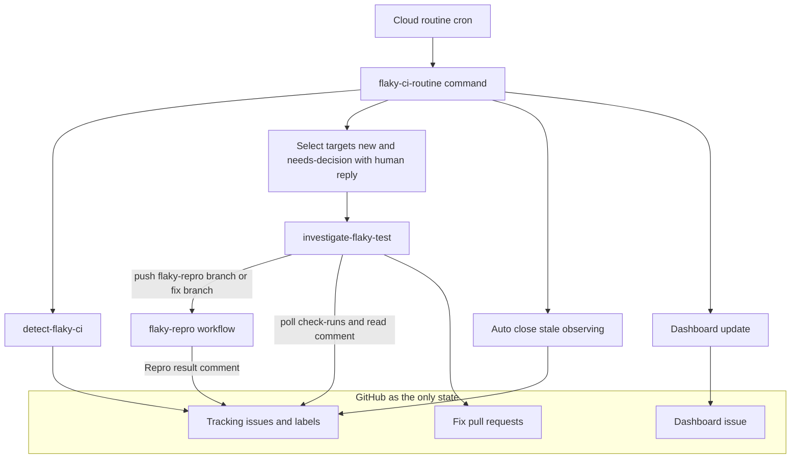
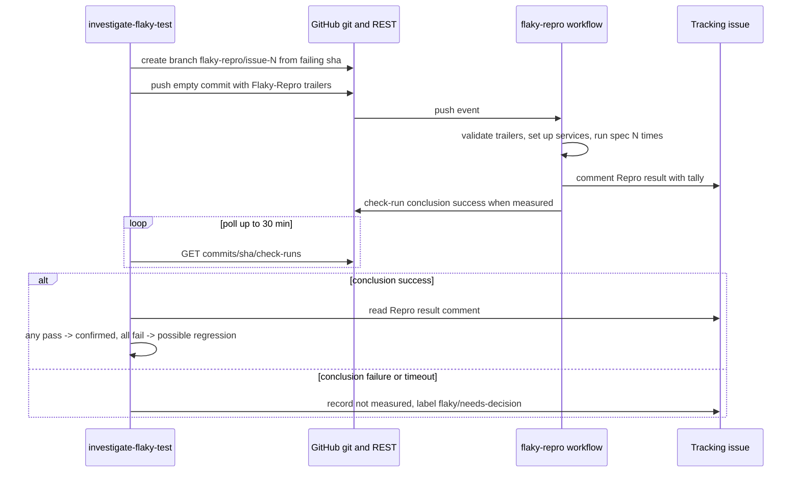
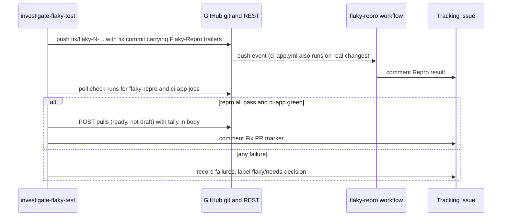
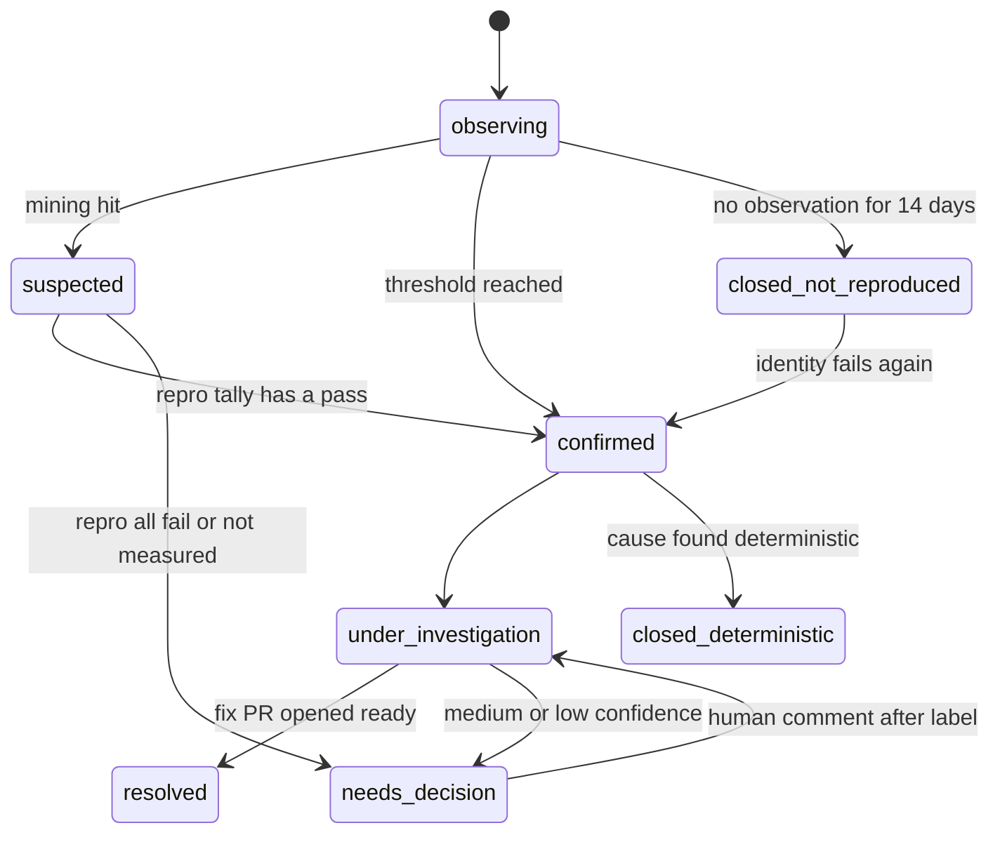

# Design Document

## Amend target

本 spec は完了済み spec `ci-flaky-test-detection` の契約を変更する amend spec である。
実装完了後、本 spec の内容を元 spec に移し、本 spec は自身を削除する（`.claude/rules/spec-lifecycle.md`）。

| 対象 | 変わる契約 |
|---|---|
| `ci-flaky-test-detection` Requirement 2（エスカレーション） | 疑いあり → 確定の確認手段が「CI 再実行 1 回」から「push 起動の再現実行 N 回の集計」に変わる（Requirement 6） |
| 同 Requirement 1（検出と issue 追跡） | 識別子のまとめ方（巻き添え・連鎖）と追跡対象外の条件が追加される（Requirement 7・8） |
| 同 Requirement 3（自律調査と修正） | 修正 PR は下書きを経由せず Ready で開く。中/低確信度での停止が「判断待ち」状態になる（Requirement 6・9） |
| 同 Requirement 5（ダッシュボード） | 「人の判断待ち」の節と自動クローズの報告が加わる（Requirement 9・10） |
| 同 Revalidation Triggers | 再現 workflow の trailer 名・コメント見出し・ブランチ名パターン・ラベル名が追加される |
| `.claude/skills/detect-flaky-ci/SKILL.md`、`.claude/skills/investigate-flaky-test/SKILL.md`、`.claude/commands/flaky-ci-routine.md` | 手順本文 |
| クラウド routine `growi-flaky-ci-routine`、`Investigate GROWI Issues` | プロンプト（起動間隔に合わせた窓、flaky issue の除外） |

## Overview

**Purpose**: 無人で動く flaky test 対応ルーティンを「放っておいても flaky test の件数が減っていく閉じたループ」にする。
現行の仕組みは検出・調査の能力はあるが、(1) 実行環境が持たない権限を必須ゲートにしていて全件が判断待ちで止まる、(2) 止まった事実が見えず再び拾われない、(3) 1 原因が複数 issue に分かれ flaky でないものも混ざる、の 3 点で収束しない。

**Users**: GROWI のメンテナー（ダッシュボードと判断待ち issue を見て判断を返す）、ルーティンのオペレーター（起動間隔とプロンプトを保つ）。

**Impact**: 既存の 2 スキルと 1 コマンドの手順を改め、GitHub Actions workflow を 1 本追加し、通常 CI の 2 workflow に `branches-ignore` を 1 行ずつ足す。ラベルを 1 つ追加し、クラウド routine 2 つのプロンプトを更新する。アプリケーションコードは変更しない。

### Goals
- 疑いあり issue の確認と修正の検証を、`actions:write` 無しで数値の集計として得る（6.1〜6.7）
- 1 原因 = 1 issue に近づける（7.1〜7.4）、flaky でないものを追跡対象から外す（8.1〜8.4）
- 判断待ちを状態として持ち、人の返答で再開する（9.1〜9.5）
- 再発しない issue を自動で閉じる（10.1〜10.3）
- 起動間隔・隣接 routine と整合させる（11.1〜11.3）

### Non-Goals
- テスト基盤そのものの修正（#11752 の根本修正。案は memory `project_growi_integ_test_migration_template_db_plan` に記録済み）と個別テストの設計不良の修正
- Playwright の再現実行（PR 自身の `run-playwright` を検証とする。研究ログ参照）
- 検出ロジックのスクリプト化（元 spec の research.md にある将来案。本 spec では手順書の改訂に留める）
- ダッシュボードの表現力向上（表形式のまま。節を 2 つ足すだけ）

## Boundary Commitments

### This Spec Owns
- 再現実行の依頼と結果の**約束事**（git trailer の名前と値の範囲、結果コメントの見出しと行形式、ブランチ名パターン）
- 再現 workflow `.github/workflows/flaky-repro.yml` の挙動（前処理・N 回実行・集計・結果の書き出し）
- `detect-flaky-ci` の識別子集約と追跡対象外の判定ルール
- `investigate-flaky-test` の確認ゲート・修正検証・PR 作成手順
- `flaky-ci-routine.md` の対象選択（判断待ちの再開を含む）・自動クローズ・ダッシュボードの新しい節・報告項目
- ラベル `flaky/needs-decision` の意味と付け外しの条件
- クラウド routine 2 つのプロンプト文言

### Out of Boundary
- `ci-app.yml` / `ci-app-prod.yml` のジョブ構造（`branches-ignore` に 1 行足すだけ。サービス起動手順の共通化は行わない）
- `apps/app` 配下のテスト・テスト基盤・アプリケーションコード
- 生成された PR のレビューとマージ（通常の開発手順に委ねる。routine はマージしない）
- Playwright の再現実行、モデル選択（判断材料の提示まで）

### Allowed Dependencies
- GitHub REST API（`gh api`）— issue / label / PR / commits compare / check-runs / issue events の読み書き。GraphQL は使わない
- GitHub Actions（push トリガー、`GITHUB_TOKEN` の `issues: write` / `contents: read`）
- 既存のジョブログ取得手段の一度きりの決定（`flaky-ci-routine.md` Step 0）
- `apps/app` の vitest プロジェクト名と `package.json` のテストスクリプト名（`test:unit` / `test:components` / `test:integ`）— 読むだけ

### Revalidation Triggers
- trailer 名（`Flaky-Repro-*`）、結果コメントの見出し `### Repro result` と行形式、ブランチ名パターン（`flaky-repro/**`, `fix/flaky-**`）の変更
- ラベル名 `flaky/needs-decision` の変更、既存 `flaky/*` / `phase/*` の変更
- `ci-app.yml` の統合テスト用サービス起動手順（MongoDB / Elasticsearch のアクションとバージョン）の変更 — `flaky-repro.yml` に同じ手順を複製しているため同時に直す
- vitest プロジェクト名の追加・改名、`test:*` スクリプトの変更
- cron の起動間隔の変更（窓 = 最長間隔 × 2 の再計算）
- 自動投稿の署名文言（`_Generated by [Claude Code]` / `*Investigated by Claude Code`）の変更 — 人のコメント判定が依存する
- 元 spec が挙げる既存の Revalidation Triggers はすべて引き継ぐ

## Architecture

### Existing Architecture Analysis

- 状態は GitHub の issue / label / PR にだけ持ち、routine は実行間の記憶を持たない。本設計もこれを守り、再現結果も issue コメントとして残す
- `detect-flaky-ci` はコードに触れず、`investigate-flaky-test` が修正する分離を維持する。再現 workflow は両者から独立した「測定器」で、どちらのスキルも同じ約束事で使う
- `flaky-ci-routine.md` は薄いオーケストレーションに留める。新しい選択条件（判断待ちの再開）は Step 2 の拡張、自動クローズは Step 3 の後に**新 Step として挿入**（以降のダッシュボード更新は Step 5、報告は Step 6 に繰り下がる）、ダッシュボードの節と報告項目はそれぞれ繰り下げ後の Step 5 / Step 6 の拡張として置く
- 通信は REST のみ、ジョブログ取得手段は Step 0 で 1 回決定、という既存の制約はそのまま

### Architecture Pattern & Boundary Map



**Architecture Integration**:
- Selected pattern: 既存の「2 スキル＋薄いコマンド」に、GitHub Actions 上の測定器を 1 つ足す。測定器はスキルから見て「push すると issue にコメントが返る」だけの部品
- Domain/feature boundaries: 検出（識別・除外・集約）／調査（確認・修正・PR）／可視化と選択（判断待ち・自動クローズ・ダッシュボード）／測定（workflow）の 4 つ
- Existing patterns preserved: exact-title-match、REST のみ、`-X GET` 規約、コメント見出しによる機械的な分類
- New components rationale: 測定器を外に出すことで、権限の無い環境でも「数字で確認する」を実現する。判断待ちラベルは「止まっている」を状態にするために必要
- Steering compliance: アプリコードに触れないため `tech.md` の技術スタック規約は対象外。`coding-style.md` の「実行者は作業対象を入力として受け取る」は、workflow が対象を trailer から受け取る形で満たす

### Technology Stack

| Layer | Choice / Version | Role in Feature | Notes |
|-------|------------------|-----------------|-------|
| Infrastructure / Runtime | GitHub Actions（`ubuntu-latest`）、`pnpm/action-setup@v6`、`actions/setup-node@v6`、`supercharge/mongodb-github-action@1.12.1`、`elastic/elastic-github-actions/elasticsearch@master` | 再現 workflow の実行環境。バージョンとアクションは `ci-app.yml` と同一 | 変更時は両方を直す |
| Backend / Services | vitest 3.2.6（`apps/app`） | 対象 spec の N 回実行 | プロジェクト名 allowlist |
| Messaging / Events | GitHub REST API（`gh api`） | 状態の読み書き | GraphQL 不可 |
| CLI | `gh` 2.45.0 以上（クラウド）、Claude Code スキル（Markdown 手順） | 手順の実行主体 | — |

## File Structure Plan

### Directory Structure
```
.github/workflows/
├── flaky-repro.yml            # 新規: 再現 workflow（Repro Workflow）
├── ci-app.yml                 # 変更: push.branches-ignore に flaky-repro/** を追加
└── ci-app-prod.yml            # 変更: 同上
.claude/skills/
├── detect-flaky-ci/SKILL.md   # 変更: 集約ルール（7）、追跡対象外（8.1〜8.3）、denylist 追記
└── investigate-flaky-test/SKILL.md
                               # 変更: Step 2 確認ゲート（6.1〜6.3, 6.6）、Step 5/6 修正検証と Ready PR（6.4, 6.5）、
                               #       決定的原因のクローズ（8.4）、判断待ちラベル付与（9.1）、購読・再起床の禁止（9.5）
.claude/commands/
└── flaky-ci-routine.md        # 変更: Step 2 選択条件（9.3）、新 Step 自動クローズ（10）、ダッシュボードの節（9.2, 9.4, 10.3）、
                               #       報告項目（11.3）、購読・再起床の禁止（9.5）
.kiro/specs/flaky-ci-closed-loop/
                               # 本 spec。最終タスクで ci-flaky-test-detection へ移して削除
```

### 変更ファイルと責務
- `flaky-repro.yml`（新規）— trailer を読み、allowlist で検証し、対象を N 回実行し、集計を issue コメントとサマリに書く。テストの合否で job を落とさない
- `ci-app.yml` / `ci-app-prod.yml` — `flaky-repro/**` への push で動かない保証だけを足す
- `detect-flaky-ci/SKILL.md` — Step 3（識別抽出）に巻き添え・連鎖の判定を、Step 4（照合）の手前に追跡対象外の判定を追加。Step 2 の denylist に `Failed to download file.` を追加
- `investigate-flaky-test/SKILL.md` — Step 2 の「`gh run rerun`」節を「Repro Request の push と結果待ち」に置き換える。Step 5-B/6-A/6-B を「fix ブランチに trailer 付きでコミット → Repro result を待つ → Ready で PR 作成」に置き換える。Step 4 の確信度表を集計値ベースに書き換える
- `flaky-ci-routine.md` — Step 2 に判断待ち再開の選択を追加。Step 3 の後に「自動クローズ」を新 Step として挿入。Step 5（繰り下げ後のダッシュボード）に節を追加。Step 6（繰り下げ後の報告）の報告項目を追加

### リポジトリ外の変更（tasks で運用タスクとして扱う）
- ラベル `flaky/needs-decision` の作成
- `growi-flaky-ci-routine` のプロンプトに `--window-hours=32` を追加（または cron を `0 */8 * * *` に変更）。モデル変更は判断材料の提示のみ
- `Investigate GROWI Issues` のプロンプトに「`flaky/` で始まるラベルを持つ issue は対象外」を追加

## System Flows

### 疑いあり issue の確認（6.1〜6.3, 6.6）



- 確認用ブランチは失敗コミットから切る。空コミットなのでテスト対象の木は失敗時と同一
- `ci-app.yml` / `ci-app-prod.yml` は `flaky-repro/**` を `branches-ignore` に持つので動かない（6.7）
- 待ち時間の上限は 30 分。超えたら「測定できなかった」として 6.6 の経路

### 修正の検証と PR 作成（6.4, 6.5）



### 追跡 issue の状態遷移（9, 10）



- `needs_decision` は `flaky/needs-decision` ラベルで表す。tier ラベル（`flaky/*`）と phase ラベルはそのまま残す（判断待ちは tier の別軸）
- 人のコメントで再開したら `flaky/needs-decision` を外す

## Requirements Traceability

| Requirement | Summary | Components | Interfaces | Flows |
|-------------|---------|------------|------------|-------|
| 6.1 | N 回独立実行の集計を権限無しで取得 | Repro Workflow, Confirmation Gate | Repro Request / Repro Result | 確認 |
| 6.2 | 1 回でも成功 → 確定、集計を記録 | Confirmation Gate | Repro Result | 確認 |
| 6.3 | 全回失敗 → 回帰の可能性 | Confirmation Gate | Repro Result | 確認 |
| 6.4 | 修正後 N 回連続成功 → Ready で PR | Fix Verification | Repro Request / Repro Result / PR 作成 | 修正検証 |
| 6.5 | 連続実行に失敗 → PR 作らず判断待ち | Fix Verification, Needs-Decision State | — | 修正検証 |
| 6.6 | 測定できない → 静的証拠で代用せず判断待ち | Confirmation Gate, Needs-Decision State | check-run conclusion | 確認 |
| 6.7 | 通常 CI を増やさない | CI Exclusion | `branches-ignore` | 確認 |
| 7.1 | 同一 run の他ファイル timeout を巻き添え記録 | Identity Aggregation | 巻き添えコメント | — |
| 7.2 | フック timeout 無しの run で再発 → 独立 issue | Identity Aggregation | — | — |
| 7.3 | ファイル内連鎖は先頭のみ | Identity Aggregation | — | — |
| 7.4 | 巻き添え・連鎖を行として数えない | Dashboard Sections | ダッシュボード | — |
| 8.1 | master に無いコミット＋PR が spec を変更 → 対象外 | Non-flaky Exclusion | REST compare / PR files | — |
| 8.2 | lockfile 差分にパッケージ名 → 無関係と判定しない | Non-flaky Exclusion | PR files patch | — |
| 8.3 | 外部取得失敗は denylist | Non-flaky Exclusion | denylist | — |
| 8.4 | 決定的原因 → flaky 追跡としてクローズ | Deterministic-Cause Close | クローズコメント | 状態遷移 |
| 9.1 | 停止時にラベル＋推奨 1 行 | Needs-Decision State | ラベル / コメント | 状態遷移 |
| 9.2 | ダッシュボードに判断待ちの節 | Dashboard Sections | ダッシュボード | — |
| 9.3 | 人のコメントで再選択・再開 | Target Selection | REST issue events / comments | 状態遷移 |
| 9.4 | 停止後の新規観測数を表示 | Dashboard Sections | ダッシュボード | — |
| 9.5 | 購読・再起床をしない | Routine Discipline | — | — |
| 10.1 | observing 14 日で自動クローズ | Stale Auto-close | クローズコメント | 状態遷移 |
| 10.2 | 再発で再オープン | 既存 CLOSED-issue 経路 | — | 状態遷移 |
| 10.3 | 自動クローズを報告 | Stale Auto-close, Dashboard Sections | 報告 | — |
| 11.1 | 窓 = 最長間隔 × 2 | Operations Config | routine プロンプト | — |
| 11.2 | 汎用 routine は flaky を除外 | Operations Config | routine プロンプト | — |
| 11.3 | 報告に確認実行回数・CI 時間・判断待ち・自動クローズ件数 | Routine Report | Step 5 報告 | — |

## Components and Interfaces

| Component | Domain/Layer | Intent | Req Coverage | Key Dependencies (P0/P1) | Contracts |
|-----------|--------------|--------|--------------|--------------------------|-----------|
| Repro Workflow | 測定（GitHub Actions） | trailer で指定された spec を N 回実行し集計を issue に書く | 6.1, 6.4 | GitHub Actions (P0), Repro Request 規約 (P0), `ci-app.yml` と同じサービス起動 (P1) | Batch, Event |
| Repro Request / Result 規約 | 測定（共有契約） | 依頼（trailer）と結果（コメント）の形を固定する | 6.1〜6.4 | — | Event, State |
| CI Exclusion | 測定 | `flaky-repro/**` で通常 CI を動かさない | 6.7 | `ci-app.yml`, `ci-app-prod.yml` (P0) | — |
| Confirmation Gate | 調査（investigate Step 2） | 疑いあり issue を集計で確定／回帰／未測定に振り分ける | 6.1〜6.3, 6.6 | Repro Workflow (P0), REST check-runs (P0) | Batch |
| Fix Verification | 調査（investigate Step 5/6） | 修正後の連続成功を取り、Ready で PR を開く | 6.4, 6.5 | Repro Workflow (P0), ci-app.yml の結果 (P1), REST pulls (P0) | Batch |
| Deterministic-Cause Close | 調査（investigate Step 3/4） | 決定的原因と判定した issue を flaky 追跡から外す | 8.4 | REST issues (P0) | State |
| Identity Aggregation | 検出（detect Step 3/4） | 巻き添えと連鎖を 1 issue にまとめる | 7.1〜7.3 | ジョブログ (P0) | State |
| Non-flaky Exclusion | 検出（detect Step 2/4） | master に無いコミット・lockfile・外部取得を除外 | 8.1〜8.3 | REST compare / pulls files (P0) | — |
| Needs-Decision State | 可視化（investigate + routine） | 判断待ちをラベルと推奨 1 行で表す | 6.5, 6.6, 9.1 | REST labels (P0) | State |
| Target Selection | 可視化（routine Step 2） | 新規と「人が返答した判断待ち」を調査対象にする | 9.3 | REST issue events / comments (P0) | Batch |
| Stale Auto-close | 可視化（routine 新 Step） | 14 日再発なしの observing を閉じる | 10.1, 10.3 | REST issues (P0) | Batch |
| Dashboard Sections | 可視化（routine Step 5、繰り下げ後） | 判断待ちの節・自動クローズの節を追加 | 7.4, 9.2, 9.4, 10.3 | 既存 Dashboard Updater (P0) | State |
| Routine Discipline | 可視化 | 購読・再起床の禁止を明記 | 9.5 | — | — |
| Routine Report | 可視化（routine Step 6、繰り下げ後） | 報告項目の追加 | 11.3 | — | — |
| Operations Config | 運用（リポジトリ外） | ラベル作成、routine プロンプト更新 | 9.1, 11.1, 11.2 | RemoteTrigger / REST labels (P0) | — |

### 測定

#### Repro Request / Result 規約

| Field | Detail |
|-------|--------|
| Intent | routine と workflow の間の唯一の契約。依頼は git trailer、結果は issue コメント |
| Requirements | 6.1, 6.2, 6.3, 6.4 |

**Responsibilities & Constraints**
- 依頼は head commit の trailer で表す。値は allowlist で検証され、検証に落ちた依頼は「測定できなかった」扱い
- 結果は追跡 issue への 1 コメント（1 コミット SHA につき 1 件）。見出しは `### Repro result` で固定し、観測カウントの見出しと衝突させない

**Contracts**: Event [x] / State [x]

##### Event Contract — Repro Request（git trailer）

```typescript
interface ReproRequest {
  /** リポジトリ内に存在する spec のパス（apps/app 起点）。シェル展開せず vitest の引数にそのまま渡す */
  'Flaky-Repro-Spec': string;
  'Flaky-Repro-Project': 'app-unit' | 'app-components' | 'app-integration' | 'app-integration-exclusive';
  /** file: 対象 spec を別プロセスで Repeat 回。suite: project のテストスクリプトを CI と同条件で 1 回 */
  'Flaky-Repro-Mode': 'file' | 'suite';
  /** 1〜10。既定 3 */
  'Flaky-Repro-Repeat': number;
  /** 結果コメントの投稿先。無ければサマリのみ */
  'Flaky-Repro-Issue': number;
}
```

- 起動ブランチ: `flaky-repro/**`（確認。空コミット）と `fix/flaky-**`（修正。実コミット）
- `suite` モードのスクリプト対応: `app-unit` → `test:unit`、`app-components` → `test:components`、`app-integration` / `app-integration-exclusive` → `test:integ`
- 前提生成物: `app-components` は `dev:pre:styles-components`、統合系は `pre:styles-bulk-export`（turbo の `test:*` が依存する生成物と同じ）

##### State — Repro Result（issue コメント）

```typescript
interface ReproResult {
  heading: '### Repro result';
  sha: string;            // - Commit: <sha>
  branch: string;         // - Branch: <name>
  mode: 'file' | 'suite'; // - Mode: file
  runs: number;           // - Runs: 3
  failed: number;         // - Failed: 1
  /** 各回の結果。file モードのみ。例: pass, fail, pass */
  perRun: ReadonlyArray<'pass' | 'fail'>;
  runUrl: string;         // - Workflow run: <url>
  /** 失敗回の FAIL ブロック抜粋（先頭 40 行） */
  excerpt?: string;
}
```

- 行形式は `- Key: value` の固定並び。routine は `- Failed:` と `- Runs:` の 2 行だけを機械的に読む
- check-run の conclusion: 前処理と N 回実行が完了 → `success`。trailer 不正・依存インストール失敗・サービス起動失敗・spec 不在 → `failure`。テストの合否は conclusion に反映しない

#### Repro Workflow（`.github/workflows/flaky-repro.yml`）

| Field | Detail |
|-------|--------|
| Intent | Repro Request を受けて対象を N 回実行し、Repro Result を書く |
| Requirements | 6.1, 6.4 |

**Responsibilities & Constraints**
- `on: push: branches: ['flaky-repro/**', 'fix/flaky-**']`。`pull_request` では動かさない（fork からの起動を防ぐ）
- `permissions: contents: read, issues: write`
- 手順: checkout → trailer 読み取り（`git log -1 --format=%(trailers:key=...,valueonly)`）→ allowlist 検証 → pnpm / node / 依存インストール（`ci-app.yml` と同じアクションとバージョン）→ project に応じたサービス起動（統合系のみ MongoDB replica set と Elasticsearch）→ 前提生成物 → N 回実行 → 集計 → issue コメントとジョブサマリ
- `file` モードは `pnpm vitest run --project=<project> <spec>` を 1 回ずつ別プロセスで繰り出す。統合系は `--poolOptions.forks.maxForks=4` を `test:integ` と揃える
- テストが落ちても job は落とさない（`continue-on-error` ではなく、実行結果を変数に集計して最後に `exit 0`）。前処理の失敗だけが job の失敗

**Dependencies**
- External: GitHub Actions ランナー、`supercharge/mongodb-github-action@1.12.1`、`elastic/elastic-github-actions/elasticsearch@master` — サービス起動 (P0)
- Outbound: 追跡 issue — 結果コメント (P0)

**Contracts**: Batch [x] / Event [x]

##### Batch / Job Contract
- Trigger: 上記ブランチへの push
- Input / validation: Repro Request（allowlist。落ちたら `failure` で終了し、理由をサマリに書く）
- Output / destination: Repro Result コメント（`Flaky-Repro-Issue` がある場合）＋ジョブサマリ
- Idempotency & recovery: 同じ SHA への再 push は無いのでコメントは 1 件。手動で再実行した場合は同じ SHA で 2 件目が付くが、routine は最新のものを読む

**Implementation Notes**
- Integration: サービス起動手順は `ci-app.yml` の `ci-app-test-integration` と同一にし、両ファイルに相互参照コメントを置く
- Validation: 既知の安定 spec で 3/3 pass、既知の決定的失敗（依存の重複を再現した lockfile）で 3/3 fail、存在しない spec パスで `failure`、の 3 シナリオを実測する
- Risks: サービス起動手順の乖離（Revalidation Trigger）。`ubuntu-latest` の同時実行枠を通常 CI と取り合う（file モードは 1〜3 分なので影響は小さい）

#### CI Exclusion

`ci-app.yml` と `ci-app-prod.yml` の `on.push.branches-ignore` に `flaky-repro/**` を追加する。`fix/flaky-**` は除外しない。`paths` フィルタの挙動に依存しない保証（研究ログ参照）。

### 調査（`investigate-flaky-test/SKILL.md`）

#### Confirmation Gate（Step 2 の置き換え）

| Field | Detail |
|-------|--------|
| Intent | 疑いあり issue を「確定／回帰の可能性／未測定」に振り分ける |
| Requirements | 6.1, 6.2, 6.3, 6.6 |

**Responsibilities & Constraints**
- 失敗 run の SHA からブランチ `flaky-repro/issue-<N>-<短い識別>` を切り、空コミットに Repro Request を載せて push（Mode `file`、Repeat 既定 3、Issue = N）
- 30 分を上限に REST `GET /repos/{o}/{r}/commits/{sha}/check-runs` を 60 秒間隔で確認。`flaky-repro` の check-run が `completed` になったら Repro Result を読む
- 判定: `Failed < Runs` → `flaky/confirmed` に格上げし、集計を「記録済みの失敗 1 件 + Failed / Runs + 1」の形で issue に書く。`Failed == Runs` → 「本物の回帰の可能性」を issue に明示し Step 4 で MEDIUM。check-run が `failure` か 30 分超過 → 「確認未実施」を書き、`flaky/needs-decision` を付けて停止
- `flaky/confirmed` で来た issue はこのゲートを通らない（従来どおり）
- 確認用ブランチは結果を読んだ後に削除する（`DELETE /repos/{o}/{r}/git/refs/heads/...`）

**Contracts**: Batch [x]

#### Fix Verification（Step 5-B / 6-A / 6-B の置き換え）

| Field | Detail |
|-------|--------|
| Intent | 修正を N 回連続成功で検証し、Ready で PR を開く |
| Requirements | 6.4, 6.5 |

**Responsibilities & Constraints**
- ブランチ `fix/flaky-<N>-<短い説明>`。修正コミットの本文に Repro Request（Mode `file`、Repeat 既定 3、Issue = N）を trailer として付けて push
- `flaky-repro` と `ci-app.yml` の両方の check-run を待つ（上限 45 分）。`Failed == 0` かつ `ci-app-*` が全て `success` のとき、REST `POST /repos/{o}/{r}/pulls` で **draft ではない** PR を作成し、本文の Verification 節に集計値と両 run の URL を書く。作成直後に `**Fix PR**: {URL}` マーカーを issue に書く（既存の Dashboard Updater との契約は変えない）
- どちらかに失敗があれば PR を作らず、失敗内容を issue に書いて `flaky/needs-decision` を付ける
- Playwright の修正は Repro Request を付けず、PR を Ready で開いて本文に「検証は PR の `run-playwright` に委ねる」と明記する（研究ログ参照）
- PR や issue のイベント購読、再起床の予約は行わない（Routine Discipline）

**Contracts**: Batch [x]

#### Deterministic-Cause Close（Step 3/4 への追加）

調査で「非決定的ではない」（依存の重複、生成物の不足、ビルド順序、マージキュー上だけの不整合など）と判定したら、理由を書いて `not planned` でクローズし、phase ラベルを `⏏ phase/wontfix` に付け替える（`5️⃣ phase/resolved` は使わない。flaky 追跡としては終了であり、原因の修正は通常の issue / PR で扱う）。クローズコメントの見出しは `### Closed: deterministic cause, not flaky` で固定する（`detect-flaky-ci` の再オープン判定が `Fixed by` を探す経路と区別するため）。

### 検出（`detect-flaky-ci/SKILL.md`）

#### Identity Aggregation（Step 3/4 への追加）

| Field | Detail |
|-------|--------|
| Intent | 巻き添えと連鎖を 1 issue にまとめる |
| Requirements | 7.1, 7.2, 7.3 |

**Responsibilities & Constraints**
- 巻き添え: 1 つのジョブログに `test/setup/` 配下を指す `Hook timed out` があるとき、同じログ内の他ファイルの `Hook timed out` / `Test timed out` は独立 issue にせず、共有フックの追跡 issue に `### Collateral candidate` 見出しでコメントする（run URL・ファイル・テスト名・timeout 値）。アサーション失敗・unhandled rejection・接続エラーは対象外
- 巻き添え候補として記録したテストが、共有フック timeout を含まない run で失敗したときは通常の識別として Step 4 に進む（そのとき候補コメントの run URL を初回観測の補足として引く）
- 連鎖: 同一ファイルで同一 run に複数の `FAIL ... > title` があり、2 件目以降のエラーが先頭と同じ run で先頭より後に出ている場合、先頭の title を識別とし、後続は issue 本文の「Cascaded in the same run」節に列挙する。後続 title 単独の issue は作らない
- `### Collateral candidate` は Occurrences に数えない（Dashboard Updater の見出し一致から外れる）

**Contracts**: State [x]

#### Non-flaky Exclusion（Step 2/4 への追加）

| Field | Detail |
|-------|--------|
| Intent | flaky でない失敗を追跡対象から外す |
| Requirements | 8.1, 8.2, 8.3 |

**Responsibilities & Constraints**
- 8.1: run の `head_sha` について REST `GET /repos/{o}/{r}/compare/master...{sha}` の `status` が `ahead` か `diverged`（master の祖先でない）で、かつ run に紐づく PR の `files` に失敗 spec のパスが含まれる → 対象外。Step 5 の報告に「PR 自身の変更による失敗として除外: N 件（PR 番号）」を出す。PR が無い push run で祖先でない場合（機能ブランチへの直接 push）も同様に除外し件数を報告する
- 8.2: 判定①で PR の `files` に `pnpm-lock.yaml` があるとき、その `patch` から `+`/`-` 行に現れるパッケージ名（`'@scope/name@version'` 形式）を集め、失敗のスタックトレースに現れるパッケージ名（`node_modules/.pnpm/<name>@` または `node_modules/<name>/`）と照合。一致があれば①は不成立とし、issue 本文に「lockfile が該当パッケージを変更している」と書く
- 8.3: denylist に `Failed to download file.` を追加

#### denylist と既存手順との関係
- denylist は「追加のみ」。既存項目は変えない

### 可視化（`flaky-ci-routine.md`）

#### Needs-Decision State

| Field | Detail |
|-------|--------|
| Intent | 判断待ちをラベルと推奨 1 行で表す |
| Requirements | 6.5, 6.6, 9.1 |

- ラベル `flaky/needs-decision`（説明: "Autonomous investigation paused; a human decision is needed"）。tier / phase ラベルは残す
- 停止コメントの末尾に `- Recommendation: <1 行>` を固定形式で置く（Dashboard Sections が読む）
- 人のコメントで再開したとき、`investigate-flaky-test` が最初にこのラベルを外す

**Contracts**: State [x]

#### Target Selection（Step 2 の拡張）

| Field | Detail |
|-------|--------|
| Intent | 新規と「人が返答した判断待ち」を調査対象にする |
| Requirements | 9.3 |

- 既存: `flaky/confirmed` または `flaky/suspected` かつ `0️⃣ phase/new`
- 追加: `flaky/needs-decision` を持つ open issue のうち、REST `GET /issues/{n}/events` の最新 `labeled`（`flaky/needs-decision`）の `created_at` より後に、`user.type == "User"` で本文末尾に自動投稿の署名（`_Generated by [Claude Code]` / `*Investigated by Claude Code`）を持たないコメントがあるもの
- 再開時は `investigate-flaky-test` に「人の判断コメントの本文」を渡し、Step 4 / 6-C のゲートをその判断で通す

**Contracts**: Batch [x]

#### Stale Auto-close（新 Step、Step 3 の後）

| Field | Detail |
|-------|--------|
| Intent | 14 日再発なしの observing を閉じる |
| Requirements | 10.1, 10.3 |

- 対象: open かつ `flaky/observing`。最終観測日 = 本文 `### First observation` と観測コメント（`### Additional observation` / `### Backfilled observation`）の `Date:` の最大値
- 最終観測日から 14 日以上経過 → `### Auto-closed: not reproduced within 14 days` を書いて `not planned` でクローズ。`Fixed by` を書かない（再発時に既存の CLOSED-issue 経路が「解決時刻不明 → 再オープン」に入る）
- 日数は `--stale-days=N`（既定 14）で上書き可

**Contracts**: Batch [x]

#### Dashboard Sections（Step 5 の拡張。4.2 の挿入で旧 Step 4 から繰り下がる）

| Field | Detail |
|-------|--------|
| Intent | 判断待ちの節と自動クローズの節を足す |
| Requirements | 7.4, 9.2, 9.4, 10.3 |

- 既存の表の**下**に 2 節を追加する（表本体の列は変えない）
  - `## Awaiting human decision`: 列 `Tracking issue | Paused at | Recommendation | New observations since pause`。`Paused at` は `flaky/needs-decision` の最新 `labeled` イベント時刻、`Recommendation` は停止コメントの `- Recommendation:` 行、`New observations since pause` はその時刻より後の観測コメント数
  - `## Auto-closed this run`: 今回クローズした issue 番号と最終観測日。0 件なら `None.`
- 巻き添え候補（`### Collateral candidate`）と連鎖列挙は行を増やさない（既存の Occurrences 定義から外れているので追加の除外ロジックは不要）

**Contracts**: State [x]

#### Routine Discipline / Routine Report
- `flaky-ci-routine.md` と `investigate-flaky-test/SKILL.md` に「PR / issue のイベント購読、モバイル通知、再起床の予約を行わない。次回 cron が拾う」を明記する（9.5）
- Step 6（繰り下げ後の報告）に「再現実行の回数と合計 CI 時間（各 run の `run_started_at` と `updated_at` の差の合計）、判断待ちの件数、自動クローズの件数、PR 自身の変更として除外した件数」を追加する（11.3）

### 運用（リポジトリ外）

#### Operations Config
- ラベル `flaky/needs-decision` を REST で作成（説明 100 文字以内）
- `growi-flaky-ci-routine` のプロンプトに `--window-hours=32` を明示（11.1）。cron を `0 */8 * * *` に戻す案も併記し、ユーザーが選ぶ
- `Investigate GROWI Issues` のプロンプトの手順 1 に「ラベル名が `flaky/` で始まる issue は対象外」を追加（11.2）
- モデル: `investigate-flaky-test` を Opus 系で動かす案を判断材料として提示（研究ログ参照）。routine は 1 セッションで両スキルを動かすため、実装上は routine 全体のモデル変更になる

## Data Models

### Logical Data Model（GitHub 上の状態）

- 追跡 issue（既存）に加わるもの
  - ラベル `flaky/needs-decision`（tier / phase と併存）
  - コメント見出し: `### Repro result`（測定器が書く）、`### Collateral candidate`（検出が書く）、`### Auto-closed: not reproduced within 14 days`（routine が書く）、`### Closed: deterministic cause, not flaky`（調査が書く）。いずれも Occurrences の見出し一致（`### Additional observation` / `### Backfilled observation`）から外れる
  - 停止コメントの固定行 `- Recommendation: <1 行>`
- コミット trailer: `Flaky-Repro-Spec` / `Flaky-Repro-Project` / `Flaky-Repro-Mode` / `Flaky-Repro-Repeat` / `Flaky-Repro-Issue`
- ブランチ: `flaky-repro/issue-<N>-<slug>`（使い捨て。結果を読んだら削除）、`fix/flaky-<N>-<slug>`（PR のブランチ）
- ダッシュボード issue: 既存の表の下に 2 節

## Error Handling

### Error Strategy
- 測定器（workflow）は「測定できたか」と「テストが通ったか」を分けて表す。前者は check-run の conclusion、後者はコメント。routine は conclusion `failure` と 30 分超過を同じ「未測定」として扱い、判断待ちに回す（6.6）
- REST 呼び出しの失敗は元 spec の Error Handling（GraphQL/proxy エラー時の REST 置き換え、rate limit 時の停止）を引き継ぐ
- `flaky-repro` の check-run が見つからない（workflow ファイルがブランチに無い、`branches-ignore` に誤って一致）→ 30 分待たずに「測定器が起動しなかった」として未測定扱い。原因候補として「fix ブランチの基点が workflow 追加前のコミット」を停止コメントに書く
- 人のコメント判定が署名に依存するため、署名文言は `flaky-ci-routine.md` に定数として 1 箇所で定義し、両スキルは「`flaky-ci-routine.md` の定義を参照」と書く

### Monitoring
- Step 6（繰り下げ後の報告）の報告項目（11.3）が唯一の監視面。ダッシュボードの判断待ちの節が「止まっているもの」の一覧になる

## Testing Strategy

元 spec と同じく、スキル本文は自動テストを持たない。検証は run now と workflow の実測で行う。

- **Repro Workflow の 3 シナリオ**（6.1, 6.6）: 既知の安定 spec（例: `apps/app/src/server/util/*.spec.ts` の 1 本）で `Runs: 3 / Failed: 0` のコメントが付く。#11849 型の決定的失敗（`@codemirror/state` を 2 バージョンにした lockfile を含むブランチで `AdminCodeEditor.spec.tsx`）で `Failed: 3`。存在しない spec パスで check-run `failure` かつコメント無し
- **CI Exclusion**（6.7）: `flaky-repro/**` への空コミット push で `ci-app.yml` / `ci-app-prod.yml` の run が作られない（REST で run 一覧を確認）
- **Confirmation Gate**（6.2, 6.3）: 実在する `flaky/suspected` issue 1 件で run now し、集計が issue に書かれ、`Failed < Runs` なら `flaky/confirmed` に変わる。`Failed == Runs` の経路は上記の決定的失敗ブランチで確認
- **Fix Verification**（6.4, 6.5）: 修正ブランチに trailer 付きコミットを push し、PR が draft でなく作られ、本文に集計値が入る。故意に落ちる修正で PR が作られず `flaky/needs-decision` が付く
- **Identity Aggregation**（7.1〜7.3）: #11752 の過去 run（例: 33650461350）のログを入力に detect を run now し、`### Collateral candidate` が #11752 に付き、新規 issue が作られない。#11849 の run（34480781682）で連鎖 3 件が本文に列挙され独立 issue にならない
- **Non-flaky Exclusion**（8.1〜8.3）: #11864 の run（33857470813）で除外件数 1 が報告される。#11849 の run で①が不成立になる。`Failed to download file.` を含むログで infra noise に分類される
- **Target Selection / Needs-Decision**（9.1, 9.3）: 判断待ち issue に人がコメントした状態で routine を run now し、その issue が選ばれ、ラベルが外れる。コメントが Claude 署名付きなら選ばれない
- **Stale Auto-close**（10.1〜10.3）: 最終観測 14 日超の observing issue（#11707 が該当）がクローズされ、ダッシュボードと報告に載る
- **Dashboard Sections**（7.4, 9.2, 9.4）: 節が 2 つ追加され、既存の表の行数が巻き添え・連鎖で増えない

## Security Considerations
- workflow の `permissions` は `contents: read` と `issues: write` に限定する。`pull_request` トリガーは使わない（fork からの起動不可）
- trailer の値は allowlist と実在確認で検証し、シェルに展開しない。spec パスは vitest の引数として引用符付きで渡す
- 結果コメントに含めるログ抜粋は 40 行に切る（秘密情報の流出面を増やさない。CI ログは既に公開リポジトリで閲覧可能）

## Performance & Scalability
- file モード 1 回の所要は、統合系でサービス起動込み 3〜5 分（起動 2〜3 分＋実行 3 × 10〜20 秒）、unit / components で 1〜2 分。1 issue の確認と修正検証で合計 10 分以内
- 同時実行は通常 CI と `ubuntu-latest` の枠を共有する。routine は issue を逐次処理するので同時に走る再現は最大 1 本

## Migration Strategy
- 既存の open issue に対する扱い: `flaky/suspected` で `phase/under-investigation` のまま止まっている issue（現在 11 件）は、次回 routine の Target Selection では選ばれない（`phase/new` でも判断待ちでもない）。移行タスクとして、これらに `flaky/needs-decision` と `- Recommendation:` 行を人手（または 1 回限りの run now）で付け、ダッシュボードの判断待ちの節に載せる
- 元 spec への port-back は spec-lifecycle の手順どおり、tasks.md の最終タスクで行う
