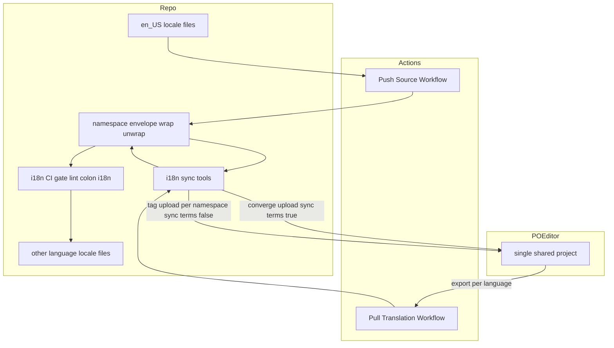
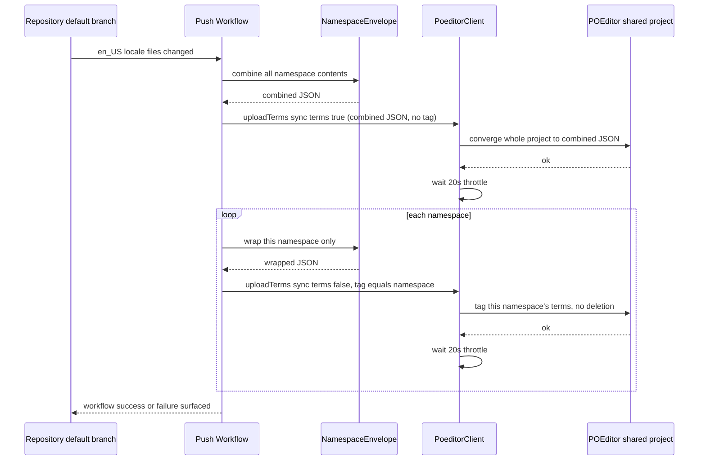
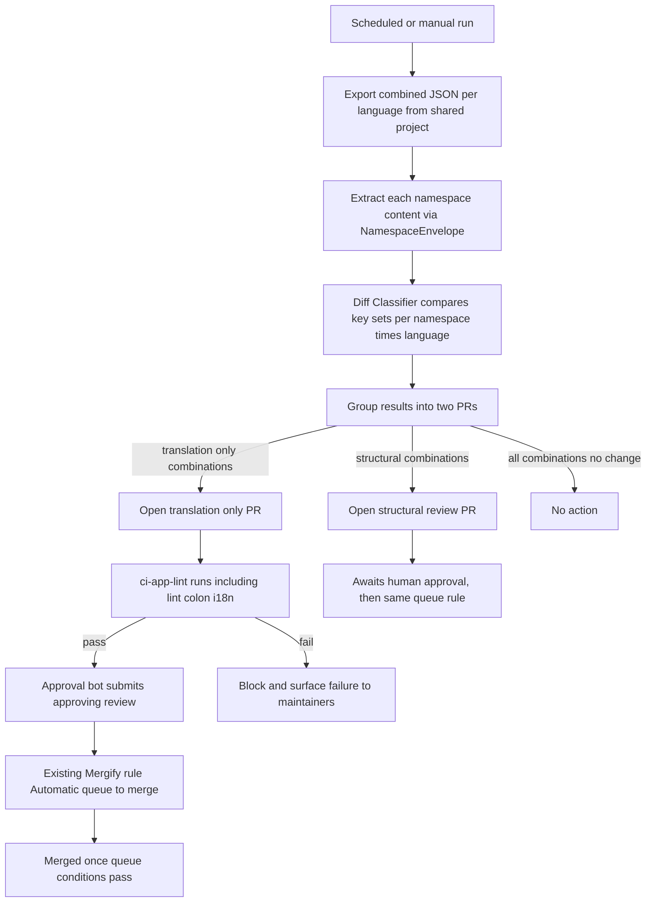

# Design Document

## Overview

GROWI は5言語の翻訳ファイルを `apps/app/public/static/locales/` に持つが、コミュニティが翻訳に貢献する導線が無い。本機能は、翻訳管理サービス POEditor を受け皿として接続し、(1) GitHub 操作なしで翻訳に参加できる導線、(2) リポジトリと POEditor 間の双方向同期、(3) 変更の種類（訳文更新か、キー構造の変更か）に応じたレビュー体制を実現する。

**Users**: GitHub アカウントを持たない翻訳ボランティア（POEditor 上で翻訳を投稿する）と、GROWI メンテナー（構造変更を伴う取り込みをレビューする）。

**Impact**: 現在の翻訳ファイルは手動の PR でのみ更新されている。本機能により、ソース言語（en_US）の変更が自動的に POEditor へ反映され、翻訳者が投稿した訳文のうち訳文のみの変更は既存の i18n CI ゲートを条件に自動でリポジトリへ反映される。

### Goals
- GitHub アカウント不要で翻訳に参加できる導線を確立する
- ソース言語（en_US）の変更を人手のコピーなしに POEditor へ反映する
- POEditor から取り込む変更を、訳文のみの変更（自動反映）とキー構造の変更（人レビュー必須）に機械的に分岐する
- 既存の i18n CI ゲート（`lint:i18n`）を、どちらの反映経路でも迂回しない
- 翻訳内容は引き続き git にコミットされたファイルのみから配信し、GROWI の実行時に POEditor への依存を作らない

### Non-Goals
- 翻訳そのものを埋める作業（本 spec は導線と同期の仕組みのみを扱う）
- `apps/app/resource/locales/`（markdown・メール ejs テンプレート）への対応
- i18next の namespace 再編、または Paraglide 等コンパイラ方式への移行（`.kiro/specs/i18n/roadmap.md` の未決事項として別途判断）
- 翻訳内容の品質保証・機械翻訳の導入
- GROWI 側で独自の翻訳進捗表示 UI を新設すること（POEditor 自体の画面を使う）

## Boundary Commitments

### This Spec Owns
- リポジトリの翻訳ファイル（`apps/app/public/static/locales/*/{admin,translation,commons}.json`）と単一の共有 POEditor プロジェクト間の双方向同期ロジック（push/pull それぞれの GitHub Actions ワークフローとその実装コード）
- 取り込む変更が「訳文のみ」か「キー構造の変更」かを判定するロジックと、それに応じた反映経路（自動反映 or 人レビュー必須の変更提案）の分岐
- POEditor 側のプロジェクト構成（全 namespace を単一の共有プロジェクトへ集約する）の決定と、単一プロジェクト内で namespace を区別する方法（JSON 構造での namespace ラップ、翻訳者向けの namespace タグ付け）
- GROWI のロケールコード（`en_US` 等）と POEditor が受け付ける言語コード（`en` 等）の対応付け
- 貢献者向けガイド文書の設置場所と内容

### Out of Boundary
- POEditor の OSS プラン申請そのもの（人手の手続き。本 spec は「承認されるまで本番運用を進めない」という条件だけを持つ）
- 翻訳の投稿・レビュー内容そのものの品質判断（POEditor 上のワークフローに委ねる）
- 既存の i18n CI ゲート（`apps/app/tools/i18n-audit/`）自体の変更。本機能はこのゲートを**呼び出す側**であり、ゲートの検出ロジックには一切手を入れない
- i18next の namespace 構成の変更。本機能は既存の3 namespace（`admin`/`translation`/`commons`）をそのまま同期単位として使う
- GROWI アプリケーション本体（`apps/app/src/`）のコード変更。本機能が触れるのは同期用ツール（`apps/app/tools/i18n-sync/`）と GitHub Actions ワークフローのみ

### Allowed Dependencies
- 既存の i18n CI ゲート（`pnpm run lint:i18n` / `apps/app/tools/i18n-audit/`）: 同期が取り込む変更の合否判定に使う。呼び出すだけで内部には依存しない
- POEditor API v2（`https://api.poeditor.com/v2/*`）: `projects/upload` / `projects/export` / `languages/list` を使う
- リポジトリの既存 CI 慣習（`paths:` トリガー、`concurrency` グループ、`secrets.*` によるトークン注入）
- `.github/mergify.yml` の既存ルール「Automatic queue to merge」（条件: `#approved-reviews-by >= 1` かつ変更要求レビューが無いこと）。**このルール自体は変更しない。** 人レビューなしで反映する経路は、このルールに乗せるために「PR作成者とは別のIDが承認レビューを送る」ことで実現する（GitHub は PR 作成者自身による自己承認を拒否するため）。もう一方の既存ルール「Automatic merge for Preparing next version」は `queue_rules` のCI条件（`ci-app-lint` 等）を経由しない direct merge であり、Requirement 3.4（CIゲートを迂回しない）に反するため使わない

### 承認ボットの必要性（新しい依存）
- 上記の「別ID承認」を実現するには、同期ワークフローの既定の `GITHUB_TOKEN` とは別に、レビュー承認を送れるボットID（GitHub App のインストールトークン、または専用ボットアカウントの PAT）が要る。これは本 spec が新たに用意する依存であり、`Security Considerations` に持ち越して扱う

### Revalidation Triggers
- `apps/app/public/static/locales/` の namespace 構成が変わる（分割・統合・ファイル名変更）→ `SyncConfig` の宣言、`namespace-envelope.ts` のラップ/アンラップ対象、両ワークフローのトリガーパスをすべて見直す必要がある
- POEditor が `projects/upload` の `tags` パラメータの仕様を変更する → namespace 単位のタグ付けを今の2段階アップロード（統合アップロード1回＋namespace ごとの非破壊的なタグ付けアップロード）で実現できなくなるため、タグ付け方式を再設計する必要がある
- namespace 単位ではなく機能単位（`comment`/`search`/`ai-agent` 等）のタグ付けを追加する場合 → キー→機能の対応表（未着手）を前提に、タグ付けアップロードの対象範囲（現在は namespace 単位）を機能単位へ広げる必要がある。既存の2段階構成はそのまま使えるため、この変更は追加であって設計のやり直しではない
- POEditor プロジェクトを複数に分ける判断がされた場合 → 単一プロジェクトを前提にした `NamespaceEnvelope` のラップ方式・タグ付け方式・`SHARED_POEDITOR_PROJECT_ID` の宣言を見直す必要がある
- i18next から Paraglide 等コンパイラ方式へ移行する（`.kiro/specs/i18n/roadmap.md` 未決事項2）→ 同期対象のファイル形式・POEditor のフォーマット指定（`type=i18next`）が成立しなくなるため、同期設定の作り直しが要る
- 既存の i18n CI ゲート（`apps/app/tools/i18n-audit/`）の検出ロジックが変わる → 自動反映経路が誤って通過/ブロックするようになっていないか再確認が要る
- `master` の branch protection / Mergify ルールが変わる → 「訳文のみの変更を人レビューなしで反映する」ための自動マージ機構が引き続き機能するか再確認が要る

## Architecture

### Existing Architecture Analysis
- 翻訳ファイルは `apps/app/public/static/locales/<lang>/{admin,translation,commons}.json` に5言語×3 namespace で存在し、実行時は `next-i18next` がこれをそのまま読み込む（`apps/app/config/next-i18next.config.mjs`）
- 既存の i18n CI ゲート（`i18n-key-audit` spec で実装済み）は `apps/app/tools/i18n-audit/run-audit.ts` が `i18next-cli status` を実行し、未使用キー・言語間欠損・存在しないキー参照を検出して `pnpm run lint:i18n`（`turbo run lint` の一部）で強制している。これは「pure function（判定ロジック）＋ 薄い I/O ラッパー」という構成を取っており、本機能もこのパターンを踏襲する
- リポジトリの GitHub Actions は `paths:` フィルタでトリガー範囲を絞り、`concurrency` グループで多重実行を防ぐ慣習がある（`research.md` 参照）
- `master` の branch protection は classic Required Reviews を使っておらず、Mergify アプリと merge queue に委ねている

### Architecture Pattern & Boundary Map



**Architecture Integration**:
- Selected pattern: 既存リポジトリを起点にした双方向 ETL（push = リポジトリ→POEditor、pull = POEditor→リポジトリ）。GitHub Actions を実行基盤とし、独立した常駐サービスは持たない
- Domain/feature boundaries: 単一の共有 POEditor プロジェクトが全 namespace の翻訳を保持する。namespace 間の区別は JSON 構造（`{namespace: content}`）とタグで表現し、プロジェクト境界では表現しない。これにより、namespace 間で意図的に重複しているキー（`commons.json` が `translation.json` から複製しているキーなど）も、1つのプロジェクトの中で互いを上書きせずに共存できる（`research.md` 参照）
- Existing patterns preserved: i18n CI ゲートの呼び出し方（`pnpm run lint:i18n`）、既存ツールの pure function 分離、GitHub Actions の `paths:`/`concurrency` 慣習
- New components rationale: POEditor という新しい外部システムとの通信・変更分類ロジックが必要なため、`apps/app/tools/i18n-sync/` を新設する。namespace の JSON ラップ/アンラップは `PoeditorClient`（POEditor API の抽象化）にも `PushSourceSync`/`PullTranslationSync`（同期オーケストレーション）にも属さない責務なので、独立した pure function モジュール（`namespace-envelope.ts`）として切り出す。ロケールコードの変換も同様に独立させる（`language-code-map.ts`）
- Steering compliance: Executors はマッピング（namespace↔ロケールファイルパス）を宣言データとして受け取り、ハードコードしない（`coding-style.md` の Executor パターン）。`namespace-envelope.ts`/`language-code-map.ts` は pure function（同 Pure Function Extraction パターン）
- 依存方向: `SyncConfig` → `PoeditorClient` → `PushSourceSync` / `PullTranslationSync` → GitHub Actions ワークフロー。`NamespaceEnvelope` と `LanguageCodeMap` はどこにも依存しない pure function で、2つのCLIだけが直接呼ぶ（`PoeditorClient` はこれらを参照しない）。逆方向の参照（ワークフローが `PoeditorClient` を直接呼ぶ、`PoeditorClient` が `SyncConfig` を書き換える等）は禁止

### Technology Stack

| Layer | Choice / Version | Role in Feature | Notes |
|-------|------------------|-----------------|-------|
| CI/CD | GitHub Actions | push/pull 同期ジョブの実行基盤 | 既存ワークフローと同じ `paths:`/`concurrency` 慣習 |
| Sync Tooling | Node.js（Native ESM, 既存の `apps/app/tools/` と同じ実行方式） | POEditor API 呼び出し・namespace のラップ/アンラップ・差分分類・ファイル書き換え | `apps/app/tools/i18n-audit/` と同じ構成に合わせる |
| External Service | POEditor API v2 | 単一の共有プロジェクトでの翻訳の受け皿・貢献者向け UI | `type=i18next` で入れ子 JSON をそのまま送受信。`projects/upload` の `tags`/`sync_terms` パラメータを使う |
| Existing Gate | `i18next-cli status`（`apps/app/tools/i18n-audit/`） | 取り込み内容の合否判定 | 変更しない。呼び出すだけ |

## File Structure Plan

### Directory Structure
```
apps/app/tools/i18n-sync/
├── sync-config.ts               # 共有プロジェクトIDと namespace <-> ロケールファイルパスの宣言（データ。コードにハードコードしない）
├── sync-config.spec.ts
├── namespace-envelope.ts        # pure function: namespaceごとのJSONを1つに統合する / 統合JSONから1 namespaceを取り出す
├── namespace-envelope.spec.ts
├── language-code-map.ts         # pure function: GROWIロケールコード -> POEditor言語コードの対応表
├── language-code-map.spec.ts
├── poeditor-client.ts           # POEditor API v2 の薄いラッパー（upload/export/languages。sync_terms/tags に対応）
├── poeditor-client.spec.ts
├── diff-classifier.ts           # pure function: 旧/新JSONのキー集合を比較し translation-only / structural を判定
├── diff-classifier.spec.ts
├── push-source.ts               # CLI: en_US を統合アップロード1回 + namespace別タグ付けの2段階で POEditor へ push
├── push-source.spec.ts
├── pull-translations.ts         # CLI: POEditor から言語ごとに export し、namespaceへ分割して分類結果に応じてファイルを書き換える
├── pull-translations.spec.ts
└── no-runtime-dependency.spec.ts # drift test: apps/app/src 配下に POEditor 呼び出しが無いことを保証（Requirement 4）

.github/workflows/
├── i18n-sync-push.yml           # en_US locale ファイル変更時に push-source.ts を実行
└── i18n-sync-pull.yml           # 定期実行 + 手動実行で pull-translations.ts を実行し、分類結果に応じてPRを作成/自動マージ

docs/
├── i18n-community-translation.md       # 貢献者向けガイド（参加方法・POEditorでの翻訳投稿方法・進捗の見方）
└── i18n-community-translation-setup.md # メンテナー向け運用手順（OSSプラン申請・共有プロジェクトの作成・public join page有効化。いずれも1プロジェクト分で済む）
```

### Modified Files
- `apps/app/package.json` — `i18n:sync:push` / `i18n:sync:pull` スクリプトを追加（既存の `lint:i18n` と同じ実行方式）
- `README.md` — 翻訳貢献ガイド（`docs/i18n-community-translation.md`）へのリンクを追加。`CONTRIBUTING.md` と `docs/` はこのリポジトリにまだ存在しないため、`docs/` は新規作成する

## System Flows

### Push: ソース言語の同期（Requirement 2）

- 統合アップロード（`syncTerms: true`）は1回のpush実行につき必ず1回だけ行う。`sync_terms` はプロジェクト全体を「今回アップロードしたファイルの内容」に収束させる操作なので、これを namespace ごとに分けて呼ぶと、後続の呼び出しが前の namespace のキーを「今回のファイルに無いキー」とみなして削除してしまう（`research.md` 参照）
- タグ付けアップロード（`syncTerms: false`）は namespace ごとに行い、削除を発生させずにタグだけを付与する。これにより翻訳者は共有プロジェクトの中を namespace で絞り込める
- アップロードは直列に実行し、POEditor の20秒レート制限を守るために呼び出し間隔を空ける
- いずれかの namespace ファイルが読み込めない場合、アップロードを一切行わずに中止する（プロジェクトが一部の namespace だけの状態へ収束してしまうことを避ける）。統合アップロードとタグ付けアップロードのいずれかが失敗した場合も、以降の呼び出しを中止する
- POEditor は GROWI のロケールコード（`en_US`）を受け付けないため、`LanguageCodeMap.toPoeditorLanguageCode` で POEditor の言語コード（`en`）へ変換してから `PoeditorClient` を呼ぶ。変換は API 呼び出しの直前だけで行い、ファイルパスの解決や namespace の処理は GROWI のロケールコードのまま扱う

### Pull: 翻訳の取り込みと分岐（Requirement 3）

- export は namespace ごとではなく**言語ごとに1回**行う。単一の共有プロジェクトなので、1回の export で全 namespace を含む統合JSONが得られる。これを `NamespaceEnvelope.extractNamespaceContent` で namespace ごとに分割してから `DiffClassifier.classify` に渡す。ここでも `LanguageCodeMap.toPoeditorLanguageCode` による変換を `PoeditorClient` の呼び出し直前だけに適用する
- 判定基準: namespace×言語ごとに、取り込み前後のキー集合（ネストしたリーフパス）が完全一致すれば「訳文のみ」、1件でも増減があれば「構造変更」
- **PRの粒度（不変条件）**: 1回のpull実行で対象になる最大12通り（namespace3×非ソース言語4）の判定結果は、**必ず2本以下のPRに分ける**。「訳文のみ」の組み合わせは1本のPRにまとめ、「構造変更」の組み合わせは（本 spec では）別の1本のPRにまとめる。**同一PRの中に構造変更の組み合わせを1件でも含めてはならない。** これに違反すると、構造変更が人レビューを経ずに反映されてしまい Requirement 3.2 を破る
- 「訳文のみ」PRは人レビューを要求しないが、必ず PR を経由し既存の i18n CI ゲート（`ci-app-lint` が包含する `lint:i18n`）を通過させる。通過した場合のみ、PR作成者とは別のID（承認ボット、`Security Considerations`参照）が承認レビューを送り、既存の `.github/mergify.yml` の「Automatic queue to merge」ルール（`#approved-reviews-by >= 1`）にそのまま乗せる。ゲートに失敗した場合は承認を送らず、default branch には反映しない（Requirement 3.3, 3.4）
- 「構造変更」PRは通常の人レビュー待ちとし、承認ボットは関与しない。人が承認すれば同じ「Automatic queue to merge」ルールでキューに乗る（既存の運用と同じ経路）

## Requirements Traceability

| Requirement | Summary | Components | Interfaces | Flows |
|-------------|---------|------------|------------|-------|
| 1.1, 1.2 | GitHub不要の参加導線 | Operational Prerequisites（共有POEditorプロジェクトのpublic join page） | — | — |
| 1.3 | 貢献手順の文書化 | Contributor Guide (`docs/i18n-community-translation.md`) | — | — |
| 2.1, 2.2, 2.3 | ソース言語のpush同期 | PushSourceSync, NamespaceEnvelope, LanguageCodeMap, PoeditorClient, SyncConfig | `PoeditorClient.uploadTerms`, `combineNamespaceContents`, `wrapSingleNamespace`, `toPoeditorLanguageCode` | Push Flow |
| 3.1, 3.2 | 変更種類での分岐 | PullTranslationSync, NamespaceEnvelope, LanguageCodeMap, DiffClassifier | `DiffClassifier.classify`, `extractNamespaceContent`, `toPoeditorLanguageCode` | Pull Flow |
| 3.3, 3.4 | CIゲート通過必須・迂回禁止 | PullTranslationSync（既存 `lint:i18n` を呼び出し） | — | Pull Flow |
| 4.1, 4.2 | 実行時の外部非依存 | no-runtime-dependency.spec.ts（drift test） | — | — |
| 5.1, 5.2 | 進捗はPOEditor画面を使う | Contributor Guide | — | — |
| 6.1 | toolbar.*キーの同期範囲包含 | SyncConfig（`translation` namespace に含まれる） | — | — |
| 7.1, 7.2 | POEditor OSSプラン運用（申請対象は共有プロジェクト1つ） | Operational Prerequisites, SyncConfig（`SHARED_POEDITOR_PROJECT_ID`） | — | — |
| 8.1 | 同期失敗の可視性 | PushSourceSync / PullTranslationSync（ワークフロー失敗として表面化） | — | Push Flow, Pull Flow |
| 9.1, 9.2, 9.3 | namespace・機能単位のタグによる絞り込み | PushSourceSync, NamespaceEnvelope, PoeditorClient, Operational Prerequisites（翻訳者はPOEditor自体のタグ絞り込みUIを使う。GROWI側の新規画面は作らない） | `PoeditorClient.uploadTerms`（`tag`指定）, `wrapSingleNamespace` | Push Flow |
| 10.1, 10.2 | ロケールコードの対応 | LanguageCodeMap, PushSourceSync, PullTranslationSync | `toPoeditorLanguageCode` | Push Flow, Pull Flow |

## Components and Interfaces

| Component | Domain/Layer | Intent | Req Coverage | Key Dependencies (P0/P1) | Contracts |
|-----------|--------------|--------|--------------|--------------------------|-----------|
| SyncConfig | Sync Tooling | 共有POEditorプロジェクトIDとnamespace↔ロケールファイルパスの宣言データ | 2.1, 6.1, 7.1 | — | State |
| NamespaceEnvelope | Sync Tooling | namespaceのJSONラップ/アンラップを行うpure function | 2.1, 2.2, 3.1, 9.1 | — | Service |
| LanguageCodeMap | Sync Tooling | GROWIロケールコード→POEditor言語コードの対応表（pure function） | 10.1, 10.2 | — | Service |
| PoeditorClient | Sync Tooling | POEditor API v2 の薄いラッパー（`sync_terms`/`tags` に対応） | 2.1, 3.1, 9.1 | POEditor API (P0) | API |
| DiffClassifier | Sync Tooling | 訳文のみ/構造変更を判定するpure function | 3.1, 3.2 | — | Service |
| PushSourceSync | Sync Tooling | en_USを統合アップロード+namespace別タグ付けの2段階でpushするCLI | 2.1, 2.2, 2.3, 8.1, 9.1, 10.1 | NamespaceEnvelope (P0), LanguageCodeMap (P0), PoeditorClient (P0), SyncConfig (P0) | Batch |
| PullTranslationSync | Sync Tooling | 言語ごとに統合exportし、namespaceへ分割して分類結果に応じて反映するCLI | 3.1, 3.2, 3.3, 3.4, 8.1, 10.1 | NamespaceEnvelope (P0), LanguageCodeMap (P0), PoeditorClient (P0), DiffClassifier (P0), 既存 `lint:i18n` (P0) | Batch |
| Contributor Guide | Docs | 貢献手順・進捗の見方の文書 | 1.3, 5.1, 5.2 | — | — |
| Operational Prerequisites | Ops（非コード） | OSSプラン申請、共有プロジェクトの作成、public join page有効化（いずれも1プロジェクト分で完結する） | 1.1, 1.2, 7.1, 7.2, 9.2 | — | — |

`Operational Prerequisites` は `docs/i18n-community-translation-setup.md` に手順として記録する（対応する file path を持つ非コード成果物）。

### Sync Tooling

#### SyncConfig

| Field | Detail |
|-------|--------|
| Intent | 全namespaceが同期先とする共有POEditorプロジェクトIDと、namespaceごとのロケールファイルパスを宣言する、唯一の情報源 |
| Requirements | 2.1, 6.1, 7.1 |

**Responsibilities & Constraints**
- 全 namespace が同期先とする単一の共有プロジェクトIDを `SHARED_POEDITOR_PROJECT_ID` として持つ。プロジェクトIDは namespace 単位の情報ではないため、`NamespaceSyncEntry` は持たない
- `NamespaceSyncEntry` は `namespace` と `localeFilePath`（言語コードからロケールファイルのパスを解決する関数）のみを持つ
- `PushSourceSync` / `PullTranslationSync` はこの宣言を読むだけで、namespace名やプロジェクトIDをコード中に直接埋め込まない（`coding-style.md` の Executor パターンに準拠）

**Contracts**: State [x]

##### State Management
```typescript
export const SHARED_POEDITOR_PROJECT_ID = 'PENDING_SHARED_PROJECT_ID'; // placeholder until provisioning

export interface NamespaceSyncEntry {
  readonly namespace: 'admin' | 'translation' | 'commons';
  // e.g. "en_US" -> "public/static/locales/en_US/admin.json" (relative to apps/app)
  readonly localeFilePath: (lang: string) => string;
}

export const SYNC_TARGETS: readonly NamespaceSyncEntry[] = [/* admin / translation / commons */];
```
- 永続化: リポジトリにコミットされた TypeScript ファイル（`sync-config.ts`）そのものが唯一の情報源。POEditor プロジェクトIDは公開してよい情報（トークンではない）だが、値そのものはプロビジョニング（`docs/i18n-community-translation-setup.md`）で共有プロジェクトを作成したときに確定する

#### NamespaceEnvelope

| Field | Detail |
|-------|--------|
| Intent | namespace の内容を共有プロジェクト用にラップ/アンラップする pure function |
| Requirements | 2.1, 2.2, 3.1, 9.1 |

**Responsibilities & Constraints**
- I/O を一切持たない。ファイル読み込み・API 呼び出しは呼び出し元（`PushSourceSync`/`PullTranslationSync`）の責務
- 複数 namespace の内容を `{namespace: content}` という形の1つの JSON に統合する（push の統合アップロード用）
- 1つの namespace の内容だけを namespace 名のキーでラップする（push のタグ付けアップロード用）
- 統合された JSON から特定の namespace の内容だけを取り出す（pull の export 結果の分割用）。該当 namespace のキーが無い、または値がオブジェクトでない場合は空オブジェクトを返す（POEditor にまだその namespace の内容が無いことを意味する）

**Contracts**: Service [x]

##### Service Interface
```typescript
export interface NamespaceContentEntry {
  readonly namespace: string;
  readonly content: Readonly<Record<string, unknown>>;
}

export interface NamespaceEnvelopeService {
  combineNamespaceContents(
    entries: readonly NamespaceContentEntry[],
  ): Record<string, unknown>;

  wrapSingleNamespace(
    namespace: string,
    content: Readonly<Record<string, unknown>>,
  ): Record<string, unknown>;

  extractNamespaceContent(
    combined: Readonly<Record<string, unknown>>,
    namespace: string,
  ): Record<string, unknown>;
}
```
- Preconditions: `combineNamespaceContents` に渡す `entries` の `namespace` は重複しないこと（保証するのは呼び出し元の責務）
- Postconditions: `extractNamespaceContent` は該当 namespace のキーが存在しない、またはオブジェクトでない場合に空オブジェクトを返す（例外を投げない）
- Invariants: 純粋関数。同じ入力に対し常に同じ結果を返す

#### LanguageCodeMap

| Field | Detail |
|-------|--------|
| Intent | GROWI のロケールコードを POEditor が受け付ける言語コードへ変換する |
| Requirements | 10.1, 10.2 |

**Responsibilities & Constraints**
- GROWI の5言語（`en_US`/`ja_JP`/`zh_CN`/`fr_FR`/`ko_KR`）それぞれに対応する POEditor 言語コード（`en-us`/`ja`/`zh-CN`/`fr`/`ko`）を宣言データとして持つ。POEditor は `en_US` のような GROWI 独自のロケールコードを受け付けない。`en_US`（米国英語）には POEditor 公式の言語コード一覧にある `en-us`（English (US)）を使う。単なる `en` はPOEditor画面上でイギリス国旗アイコンが表示されるため使わない
- 変換は `PushSourceSync`/`PullTranslationSync` が `PoeditorClient` を呼ぶ直前にのみ適用する。ファイルパスの解決（`SyncConfig.localeFilePath`）や namespace の処理は引き続き GROWI のロケールコードで行う（変換を POEditor API 境界の直前だけに閉じる）

**Contracts**: Service [x]

##### Service Interface
```typescript
export const GROWI_TO_POEDITOR_LANGUAGE: Readonly<Record<string, string>> = {
  en_US: 'en-us',
  ja_JP: 'ja',
  zh_CN: 'zh-CN',
  fr_FR: 'fr',
  ko_KR: 'ko',
};

export function toPoeditorLanguageCode(growiLocale: string): string;
```
- Preconditions: `growiLocale` は `GROWI_TO_POEDITOR_LANGUAGE` に宣言された5言語のいずれかであること
- Postconditions: 宣言されていないロケールを渡した場合は例外を投げる（呼び出し元の設定ミスであり、実行時に握りつぶすべき値ではないため）
- Invariants: 純粋関数。同じ入力に対し常に同じ結果を返す

#### PoeditorClient

| Field | Detail |
|-------|--------|
| Intent | POEditor API v2 の upload/export/languages 呼び出しを抽象化する |
| Requirements | 2.1, 3.1, 9.1 |

**Responsibilities & Constraints**
- API トークンは呼び出し元から注入される（`process.env.POEDITOR_API_TOKEN`を直接読まない。**Config層**が読み、Clientには値として渡す — 依存方向 Config→Client を守る）
- upload 呼び出し間に最低20秒の間隔を空ける責務を持つ（レート制限順守）
- export はダウンロードURLの取得までを行い、URL の10分の有効期限内にファイル取得まで完了させる
- `uploadTerms` は `syncTerms`（省略時 `true`）と `tag`（省略可）を受け取る。`syncTerms: false` のときは POEditor の `sync_terms` パラメータを送らない（POEditor は値に関わらずパラメータの存在だけで削除を有効にするため、無効化はパラメータを送らないことで表す）
- `tag` が指定されたときは `tags={"all": tag}` を送り、アップロードしたファイルに含まれる全用語へそのタグを付ける

**Dependencies**
- Outbound: なし
- External: POEditor API v2（P0）

**Contracts**: API [x]

##### API Contract
| Method | Endpoint | Request | Response | Errors |
|--------|----------|---------|----------|--------|
| POST | `/v2/projects/upload` | `{ id, updating: 'terms_translations', file, language, sync_terms?: 1, tags?: '{"all":"..."}' }` | `{ result: {...} }` | 400 (invalid file), 429 (rate limit), 500 |
| POST | `/v2/projects/export` | `{ id, language, type: 'i18next' }` | `{ result: { url } }`（10分で失効） | 400, 404 (project/language not found), 500 |
| POST | `/v2/languages/list` | `{ id }` | `{ result: { languages: [{ code, percentage }] } }` | 400, 404 |

```typescript
interface PoeditorClient {
  uploadTerms(input: {
    projectId: string;
    language: string;
    fileContent: string; // i18next JSON, stringified
    syncTerms?: boolean; // default true: converge the whole project to fileContent (deletes absent keys)
    tag?: string; // when set, tags every term in fileContent with this value
  }): Promise<Result<void, PoeditorApiError>>;

  exportTranslations(input: {
    projectId: string;
    language: string;
  }): Promise<Result<string, PoeditorApiError>>; // resolves to the downloaded file content

  listLanguages(input: {
    projectId: string;
  }): Promise<Result<readonly { code: string; percentage: number }[], PoeditorApiError>>;
}

type PoeditorApiError =
  | { type: 'rate_limited' }
  | { type: 'not_found' }
  | { type: 'invalid_request'; message: string }
  | { type: 'network_error'; cause: unknown };
```
- Preconditions: `projectId` は `SyncConfig` が宣言する `SHARED_POEDITOR_PROJECT_ID` であること。`syncTerms: false` で呼ぶ場合、`fileContent` は対象 namespace 以外の内容を含まないこと（呼び出し元が namespace 単位にラップ済みであること）
- Postconditions: `syncTerms: true` の呼び出し成功後、POEditor 側のプロジェクトは渡した内容と完全に一致する（渡していないキーは削除される）
- Invariants: `syncTerms: true` の呼び出しは1回のpush実行につき最大1回まで（呼び出し元 `PushSourceSync` が保証する）。呼び出し元（`PushSourceSync`/`PullTranslationSync`）は `PoeditorApiError` を握りつぶさず、いずれかの呼び出しで失敗したら残りの処理を中止する（Requirement 8.1）

#### DiffClassifier

| Field | Detail |
|-------|--------|
| Intent | 取り込み前後のJSONを比較し、訳文のみの変更か構造変更かを判定するpure function |
| Requirements | 3.1, 3.2 |

**Responsibilities & Constraints**
- I/O を一切持たない。ファイル読み込み・API呼び出しは呼び出し元（`PullTranslationSync`）の責務
- ネストしたリーフキーのパス集合を比較する（例: `a.b.c` が両方に存在するか）

**Contracts**: Service [x]

##### Service Interface
```typescript
type ClassificationResult =
  | { kind: 'no_change' }
  | { kind: 'translation_only'; changedKeys: readonly string[] }
  | { kind: 'structural'; addedKeys: readonly string[]; removedKeys: readonly string[] };

interface DiffClassifierService {
  classify(input: {
    before: Readonly<Record<string, unknown>>; // 現在リポジトリにあるJSON
    after: Readonly<Record<string, unknown>>;  // POEditorからexportしたJSON
  }): ClassificationResult;
}
```
- Preconditions: `before`/`after` は同一 namespace・同一言語のJSONであること
- Postconditions: `structural` と判定された場合、`addedKeys`/`removedKeys` の少なくとも一方が非空
- Invariants: 純粋関数。同じ入力に対し常に同じ結果を返す

#### PushSourceSync（CLI）

| Field | Detail |
|-------|--------|
| Intent | en_US の翻訳ファイルを、統合アップロード1回＋namespace別タグ付けの2段階で共有POEditorプロジェクトへ push する |
| Requirements | 2.1, 2.2, 2.3, 8.1, 9.1, 10.1 |

**Responsibilities & Constraints**
- `SyncConfig` が宣言する全 namespace の en_US ファイルをまず全部読み込む。1つでも読み込み・JSONパースに失敗した場合、アップロードを一度も行わずに中止し、非ゼロ終了コードでワークフローを失敗させる（Requirement 8.1。プロジェクトが一部の namespace だけの状態へ収束することを避ける）
- 読み込みに全て成功したら、`NamespaceEnvelope.combineNamespaceContents` で1つのJSONに統合し、`PoeditorClient.uploadTerms`（`syncTerms` 既定の `true`、タグなし）を**1回だけ**呼ぶ
- 続けて namespace ごとに `NamespaceEnvelope.wrapSingleNamespace` でラップし、`PoeditorClient.uploadTerms({ syncTerms: false, tag: namespace })` を呼ぶ（削除は発生しない）。統合アップロードまたはいずれかのタグ付けアップロードが失敗した時点で以降の呼び出しを中止する
- アップロードは直列に呼ぶ。20秒以上の間隔は `PoeditorClient.uploadTerms` 自身が保証するため、ここで待ち時間を二重に持たない
- POEditor API を呼ぶ直前に `LanguageCodeMap.toPoeditorLanguageCode` で言語コードを変換する

**Contracts**: Batch [x]

##### Batch / Job Contract
- Trigger: `.github/workflows/i18n-sync-push.yml`（`apps/app/public/static/locales/en_US/**` への push）
- Input / validation: 3 namespace分の en_US JSON ファイルが読み込めること
- Output / destination: 単一の共有POEditorプロジェクト
- Idempotency & recovery: 統合アップロード（`sync_terms=1`）は毎回「現在のen_USの状態」に収束させる操作なので冪等。タグ付けアップロード（`sync_terms` 無効）も非破壊的で冪等。失敗時はワークフロー再実行で復旧する

#### PullTranslationSync（CLI）

| Field | Detail |
|-------|--------|
| Intent | 共有POEditorプロジェクトから言語ごとに翻訳をexportし、namespaceへ分割したうえで `DiffClassifier` の判定に応じて自動反映PRまたはレビュー必須PRを作る |
| Requirements | 3.1, 3.2, 3.3, 3.4, 8.1, 10.1 |

**Responsibilities & Constraints**
- 非ソース言語（4言語）ごとに `PoeditorClient.exportTranslations` を**1回だけ**呼ぶ（namespaceごとの個別exportは行わない）。API を呼ぶ直前に `LanguageCodeMap.toPoeditorLanguageCode` で言語コードを変換する
- 統合exportの結果を `NamespaceEnvelope.extractNamespaceContent` で namespace ごとに分割してから `DiffClassifier.classify` に渡し、namespace×言語の組み合わせごとの結果を集計する
- **PRは判定結果の種類ごとに最大2本まで**: `translation_only` と判定された組み合わせをまとめた1本と、`structural` と判定された組み合わせをまとめた1本を、それぞれ該当する組み合わせが1つ以上あるときだけ作成する。**同一PRに `structural` の組み合わせを1件でも含めることを禁止する**（不変条件。Requirement 3.2）
- `translation_only` PR は既存の `pnpm run lint:i18n`（`ci-app-lint` の一部として実行される）の結果を確認し、通過した場合のみ、PR作成者とは別の承認ボットIDで承認レビューを送る。これにより既存の `.github/mergify.yml`「Automatic queue to merge」ルールにそのまま乗り、追加の承認なしで queue → merge まで進む。失敗した場合は承認を送らず、失敗を表面化する（新しいマージ経路や `.github/mergify.yml` の変更は行わない）
- `structural` PR は通常のレビュー必須PRとして作成するのみで、承認ボットは関与しない。人が承認すれば同じ既存ルールでキューに乗る
- `no_change`（変更なし）の組み合わせのみだった場合は何もしない

**Contracts**: Batch [x]

##### Batch / Job Contract
- Trigger: `.github/workflows/i18n-sync-pull.yml`（スケジュール実行 + `workflow_dispatch`）
- Input / validation: POEditorから取得した言語ごとの統合i18next JSONが不正な形式でないこと
- Output / destination: リポジトリの該当ロケールファイルを変更するPR
- Idempotency & recovery: 同じ差分に対して複数回実行しても、既存の未マージPRがあれば更新する（重複PRを作らない）ことをタスク実装時の要件とする

## Data Models

本機能はデータベースを持たない。唯一の永続構造は `SyncConfig`（上記）と、リポジトリ内の翻訳JSONファイルそのものである。

## Error Handling

### Error Strategy
- POEditor API呼び出しの失敗（レート制限・ネットワークエラー・不正リクエスト）は握りつぶさず、`PoeditorApiError` として呼び出し元に伝播させる
- Push/Pullいずれも、POEditor API の呼び出しが1つ失敗した場合は残りを継続せず、ワークフロー全体を失敗として終了する（部分反映によるリポジトリとPOEditor間のドリフトを避ける）

### Error Categories and Responses
- **外部サービスエラー**（POEditor APIの4xx/5xx、レート制限）: ワークフローを失敗させ、GitHub Actionsの実行失敗として既存の通知経路（リポジトリの標準的なワークフロー失敗通知）に乗せる。新しい通知チャネルは作らない（Requirement 8.1 はこれで満たす）
- **既存i18n CIゲートの失敗**: 自動反映経路であってもPRを自動マージせず、失敗したチェックとして残す(Requirement 3.3)
- **統合アップロードの失敗**: 以降のタグ付けアップロードを行わず、ワークフローを失敗させる（POEditor側の内容が中途半端に更新された可能性はあるが、`sync_terms=1` は冪等なため再実行で正しい状態に収束する）
- **タグ付けアップロードの失敗**: 内容の同期（統合アップロード）はすでに成功しているため翻訳内容の正しさには影響しないが、これもワークフロー失敗として扱い、タグ付けが不完全なまま放置されないようにする
- **不正な形式のexportデータ**: `DiffClassifier`に渡す前段でJSONパースに失敗した場合、その言語に属する全namespaceの組み合わせをまとめてスキップ扱いとし、他の言語の処理は継続する(exportは読み取り専用でリポジトリを変更しないため、pushと異なり部分失敗の許容度が高い。1回のexportが全namespaceを含むため、スキップの単位も言語ごとになる)

### Monitoring
- 既存のGitHub Actions実行ログとワークフロー失敗通知に委ねる。本機能独自のログ基盤・アラートは新設しない

## Testing Strategy

- **Unit Tests**:
  - `DiffClassifier.classify` — 訳文のみの変更/キー追加/キー削除/キーリネーム(追加+削除として扱われることの確認)/無変化の5パターン
  - `PoeditorClient` — レート制限エラー・not foundエラーが `PoeditorApiError` として正しく分類されること、`syncTerms: false` のとき `sync_terms` パラメータを送らないこと、`tag` 指定時に `tags` パラメータが正しい形式で送られること(HTTPモック)
  - `NamespaceEnvelope` — 複数namespaceの統合・1 namespaceのラップ・存在しないnamespaceの取り出し(空オブジェクトを返すこと)
  - `LanguageCodeMap.toPoeditorLanguageCode` — 5言語それぞれが正しいPOEditor言語コードへ変換されること、宣言されていないロケールを渡すと例外になること
  - `SyncConfig` — 宣言された3 namespace が既存の3ロケールファイル名(`admin.json`/`translation.json`/`commons.json`)と一致すること、宣言された `SHARED_POEDITOR_PROJECT_ID` が空でないこと、どのエントリも namespace ごとのプロジェクトIDフィールドを持たないこと
- **Integration Tests**:
  - `PushSourceSync` — 3 namespaceのうち1つでファイル読み込みが失敗した場合、アップロードが一度も実行されないこと(部分反映防止の検証)。統合アップロードが1回だけ呼ばれ、続けてnamespace数分のタグ付けアップロードが `syncTerms: false` で呼ばれること。統合アップロードが失敗した場合にタグ付けアップロードが一切呼ばれないこと
  - `PullTranslationSync` — 言語ごとのexportが1回だけ呼ばれ、その結果が正しくnamespaceへ分割されて `DiffClassifier.classify` に渡されること。`translation_only`判定後に既存`lint:i18n`が失敗するケースで、自動マージ対象PRが作られない(または失敗として扱われる)こと
  - `no-runtime-dependency.spec.ts` — `apps/app/src/` 配下に POEditor のドメイン文字列(`poeditor.com`等)への参照が無いこと(Requirement 4.1, 4.2の継続的な保証)
- **Workflow-level (manual/CI dry-run)**:
  - `i18n-sync-push.yml` を実際のPOEditorテストプロジェクトに対してdry-run実行し、統合アップロードの`sync_terms=1`によるキー追加・削除が意図通り反映されること、namespace別のタグ付けが他namespaceの用語を削除しないことを確認
  - `i18n-sync-pull.yml` が構造変更を検出した際に、レビュー必須ラベル付きPRが作成されること

## Security Considerations

- POEditor APIトークンは GitHub Actions の `secrets.POEDITOR_API_TOKEN` として注入し、コード・ログに平文で出力しない(`security.md`のSecret Management原則に準拠)
- 同期ワークフローに付与するGitHub側の権限(`contents: write` / `pull-requests: write`)は同期ジョブに必要な範囲に限定し、他のワークフロー権限を流用しない
- 「訳文のみ」PRを承認するボットID(専用GitHub Appのインストールトークン、または専用ボットアカウントのPAT)は、`secrets.I18N_SYNC_APPROVAL_TOKEN`のような専用シークレットとして注入し、他の用途と共有しない。このIDに付与する権限は「PRへの承認レビュー(pull-requests: write相当)」に限定し、`contents: write`のような書き込み権限は持たせない(承認だけができれば十分で、それ以上の権限は攻撃対象を広げるだけのため)
- POEditorから取り込む翻訳文字列はそのままJSONファイルへ書き込まれる。GROWI側での表示時のサニタイズは既存のi18next/Reactのレンダリング経路にすでに存在するため、本機能側で追加のサニタイズは行わない(Non-Goal)
